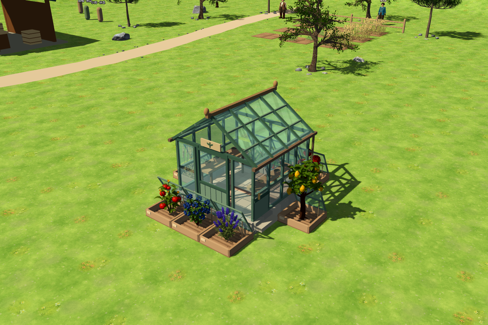

# 八床育苗温室：模型、生产与经营设计

## 本轮交付边界

已实现原生 3D 温室、施工阶段、真实种植床的空间检查、反季节种植状态面板、维护入口和 NPC 建筑查询；接入现有播种、浇水、收获、供水、维护与存档系统。

**自营可以实际使用。下文出租合同、按床收费和租客权限是完成的下一阶段设计，尚未实现。** 当前查询明确返回 `rental_available=false`，没有不存在的出租按钮或 Agent 动作。NPC 自主建设目录本轮未扩展到温室。

## 模型与空间

选择乡村育苗房：浅色石基、暖色砖地、绿色细框、双坡透明玻璃顶、铜色屋脊、育苗工作台。东南侧留管理门，正面为观察窗；种植床不会挡住管理门。庭院尺度与现有风车、食品工坊、蜂箱保持一致。

中心建筑仍占 3×3 格；外围北侧 3 床、南侧 3 床、东西各 1 床，共 8 个真实生产位。每床有木框、可见的开启玻璃盖与标签牌，位置逐格对应 `ProductionSystem.get_greenhouse_cells()`。中心工作台和花盆是家具，不冒充可收获作物。外围实际作物继续由原作物模型系统渲染。

建造需要核心与外围床位地形平整；外围不能落在道路、水体、其他建筑、其他温室的床或他人土地。其他新建筑也不能占用现有温室床位。床位仍是普通可操作农田，玻璃盖不遮挡农事拾取射线。旧存档不迁移坐标或删除作物。



源模型约 6,266 三角面，保留 Foundation、Frame、Walls、Roof、Details 五组，分别配合施工阶段显示。玻璃材质保留透明度，玻璃不投射实心阴影。

源生成脚本、独立原始网格场景、GLB、参数清单、实景预览均归档。材质使用内嵌 PBR 色值，没有调用外部生成平台，也没有输入图片或外部纹理；清单将这些项明确记录为空，而不是只留下最终 GLB。

## 已实现的自营生产闭环

1. 花费木板 15、石砖 10、玻璃 12、铁锭 3 建造，完工后提供保护。
2. 在外围床位开垦、消耗真实种子/种苗播种。冬季也可种原本不适季的作物，温室专用作物也可种。
3. 按该作物实际游戏分钟生长，温室有效时收获产量为同一作物露天基准的 1.5～2 倍。手动浇水或有效灌溉获得 1.5 倍生长速度；已有水田的持续灌溉规则不变，未另外收取不存在的水费。
4. 成熟后由实际农事操作收获，进入真实背包，再按市场收购价格与容量出售，或供给加工、采购委托。温室本身不自动出售，也不发固定金币。
5. 建筑每 14 游戏日维护，当前费用是 33 金币、木材 1、石头 1。逾期或维修中暂停温室作物生长，保留作物与进度；完成维修后恢复。

原有土地权限继续决定谁能耕作与收获；温室保护不转移他人地块或作物的所有权。拆除/失去保护后的作物按原季节与环境规则处理，没有自动赔偿或变卖。

状态面板提供各床作物、成熟状态、实际剩余分钟、生长速度、预计收获量与露天基准、自动灌溉、维护报价与基准造价。预计分钟以当前水分条件持续为假设；没有把旧 `growth_days` 当作真实成熟时间。`query_world` 建筑详情返回同一份实时数据，不增加固定 Agent header。

## 经济定位与回本口径

温室购买的是全年种植条件、温室专用作物的生产资格与稳定供货能力。它适合冬季鲜果、订单种植、珍贵种苗和加工原料保障；普通露天适季作物没有必要一律搬进温室。

沿用经济校准后的目录价，用真实市场价差和批量滑点计算，建材一次性采购参考价 **1,893 金币**，维护采购折价 **55 金币/14 日**，约 **3.93 金币/日**。实际建造和维护仍扣各自的材料与金币，不额外扣一笔“折价”。自产材料也有可出售的机会成本。

温室自营的现金回本与相对露天种植的增量回本必须分开：假设 4 床、每两日每床收一次胡萝卜，每次净收入 36，全年稳定销售，则自营日余量约 `4×36÷2−55÷14=68.07`，现金回本约 27.8 日。但这包含很多露天本来也能获得的收入。若只有冬季 7 日的生产属于新增收入，每 28 日净增量为 `4×36÷2×7−55×2=394`，增量回本约 **134.5 日**。这两个数都未计劳动、土地、工具、市场积压，也不是实际 NPC 利用率。

因此不能为了让温室显得赚钱，就直接给所有温室产品固定高价。需要真实的反季节订单、稳定加工需求或温室专用作物支撑投资。

## 出租方案：按床位和占用时间收费

温室提供环境与床位，采用租地模式，不沿用工坊的单批加工费。第一版建议：

- 按床报价，默认 **10 金币/床/游戏日**，一个游戏日为 1,080 分钟。
- 首次租期 2 日，即每床预付 20；单份合同最多 4 日，每个 NPC 同时最多租 2 床。
- 业主可议价；签约后价格与时段锁定，不能追溯涨价。续租必须形成新报价、新合同，不自动扣续费。
- 租客承担种子、劳动、浇水、收获和销售，获得全部作物；业主承担建造和维护，获得有效服务时段租金。
- 可租数量是实际可用且未被占用的床位，不能按名义 8 床超卖。自营床不同时出租。

### 租客能否盈利

以下保留增产改动前的保守基准：按 2 日租期中只完成一次收获、收获 4 个产物、参考市场价测算。2026-09-17 起，露天基准为 4 个时，有效温室实际收获 6～8 个；应对实际数量重新调用市场报价，不能把表中收入直接乘倍数，批量滑点与收购额度仍然有效。

| 作物 | 种子采购 | 租费 | 成品卖价 | 租客余量 |
| --- | ---: | ---: | ---: | ---: |
| 胡萝卜 | 13 | 20 | 49 | 16 |
| 草莓 | 9 | 20 | 63 | 34 |
| 柠檬 | 44 | 20 | 84 | 20 |
| 土豆 | 8 | 20 | 24 | **-4** |

这不是承诺收益：原露天基准产量为 3–5，温室新增增产后应使用实际预计产量，报价可能变化，收购额度可能耗尽。低收益作物不适合这个租费，租客应拒绝、换作物或议价。Agent 签约前应用最低产量或明确的产量信息、当前种苗采购价、真实收购需求和剩余行动时间估算，目标销售利润率至少 15%；有保证收购的有效委托优先。两日内多轮种植只是可能的额外机会，不能用理论最高轮数强行证明盈利。

### 业主回报

基准建材全部采购，忽略人工与土地，只扣上述维护：

| 全年平均出租床数 | 日租金 | 日净余量 | 静态回本 |
| --- | ---: | ---: | ---: |
| 2（25% 利用率） | 20 | 16.07 | 117.8 日 |
| 4（50% 利用率） | 40 | 36.07 | 52.5 日 |
| 8（100% 利用率） | 80 | 76.07 | 24.9 日 |

温室以中等利用率 **42–84 游戏日**为初步投资目标，比普通加工建筑长；全租不是默认场景。如果只在冬季满租，其全年平均利用率正好约 25%，应按约 118 日而不是 25 日评估。后续应根据实际租赁事件统计需求，决定是否调整造价、合同价格或新增采购需求。

## 出租合同的结算与持久化约束（待实现）

- 合同至少保存 `lease_id/building_id/bed_coordinates/owner/tenant/start_minute/end_minute/rate/escrow/released/refunded/status/version`，以及结算游标、整数舍入余量。租客资金进入托管，不在签约时全部转给业主。
- 每个有效服务分钟按 `rate/1080` 累计，整金币释放给业主，零头随合同持久化，避免反复签退租套利。累计已释放、已退款、剩余托管严格等于实际预付款。
- 业主维护逾期/维修期间停止计费。合同仍按原绝对时间到期，不能延长到后续已签约时段；无效服务对应的托管余额退回租客。
- 签约同时校验床位、土地权限、余额、建筑状态和版本，并原子锁定资金与床位。重复请求使用幂等键，不能重复扣款或出租。授权判断统一供玩家和 NPC 农事动作消费。
- 业主不能收取租客作物；租客不能播种到别人的床。合同中途转让/拆除建筑必须先处理合同，不得连同作物直接删除。
- 到期后禁止再播种，保留 1 日清场期供原租客浇水、收获或清苗，床位暂不重新挂牌。清场超时，将现有作物及生长状态转入租客的持久化作物托管记录并释放床位；托管中不继续生长，恢复到合规空床时原子消费记录，不直接换成种子、金币或成熟产物。
- 当前版本尚无“作物托管恢复”能力，必须与租赁一起实现和验证，不能先开放收费再补产权处理。
- 事件记录签约、开始服务、租金释放、维护暂停、退款、到期、清场和收获；读档从最后结算游标继续，不重复结算。重要合同、待收作物与维护中断进入 NPC 持久记忆。

拟新增工具为 `quote_greenhouse_lease`、`rent_greenhouse_bed`、`renew_greenhouse_lease`、`release_greenhouse_bed`；报价只返回真实可用床、价格、状态和可执行条件。现有 `query_world` 先发现温室与床位，再查询市场、采购订单并决策，不能把温室全量经营数据重新塞回初始 context。

## 验证与使用

正式入口仍为 `scenes/farm3d/main.tscn`，在建筑 → 农业中选择温室。靠近后点击温室打开状态面板，关闭后在外围床位照常操作。未向真实存档自动放置建筑。

专项测试覆盖实际建造/材料拒扣、施工效果、8 床模型对齐、空间保护、冬季播种、种子扣除、180 分钟浇水胡萝卜成熟、实际收获、维护扣费与恢复、存读档、UI 暂停恢复及 NPC 实时查询。四个实景截图验证正面、背面、建造阶段与状态面板。

本轮结果：温室专项 **102 检查通过**；经济校准 248、地理/钓鱼 461、蜂箱 74 检查通过。原始网格、GLB 与生成脚本校验值已核对，正式存档未被测试改写。

```powershell
godot_console.exe --headless --path . --script tests/run_3d_greenhouse_tests.gd -- --farm-test
godot_console.exe --headless --path . --script scripts/tools/export_greenhouse.gd
godot_console.exe --path . --script tests/capture_3d_greenhouse.gd -- --farm-test
```

收益测算由专项测试输出到 `tmp/agent-refactor/greenhouse-economy.json`；这是一份租赁设计的静态敏感性测算，不是已运行的出租系统流水。


## 2026-09-17 增产规则

有效温室覆盖的床位全年可种，收获时按同一格、作物、收获次数与世界种子的露天基准计算整数增产：下界 `ceil(基准 × 1.5)`，上界 `floor(基准 × 2)`。范围内结果由稳定哈希决定，查看面板、重复预览和读档不会重抽；低产作物同样不会超出 2 倍上限。多个温室覆盖不叠加。

增产与水分加速相互独立：未灌溉仍以 1 倍速度生长，浇水或自动灌溉以 1.5 倍速度生长。例：胡萝卜未浇水 270 游戏分钟，持续湿润 180 分钟。水车负责自动提供灌溉，不再次乘产量。

增产由收获时的有效温室状态决定。未完工或欠维护不获得增产，维护暂停期间作物保留、停止生长，维修后恢复。查询预计数量与实际背包入库共用同一计算，状态变化后旧收获预览必须重新验证，沿用原背包容量、归属与事务回滚校验。存档无需新增字段，已有作物重载后按当前温室状态适用新规则。
