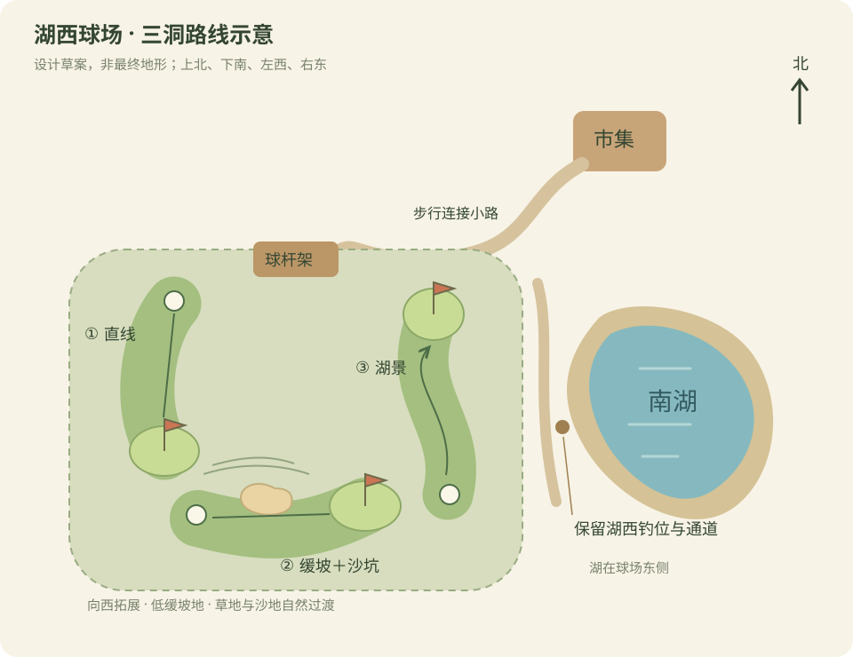

# 湖西高尔夫：初步设计选项

状态：用户已选择 C（鼠标挥杆），已接入正式 3D 游戏。操作、实际场地位置与验证见[高尔夫实现](../validation/golf-3d.md)。下图保留初步设计；实施时将球道整体放入新增西侧土地，避免占用旧地块。

建议在市集西南、南湖西侧向西扩地，做一座三洞短球场。参考现有市集默认位置（西 12、南 12 米）、南湖中心（西 6、南 108 米）、湖西钓位（西 40、南 108 米）。保留湖西钓位和步行通道，从市集引一条小路到球场入口；旧存档市集位置可能不同，连接路线随实际位置调整。

初步场地约 70×70 米，主要向当前地图西边界以外拓展；球道由浅草、深草边缘、低缓土坡、果岭和少量沙坑构成，周围保留原来的草地到沙地过渡。旧农田、建筑与湖岸坐标不移动；具体边界需在实施前检查存档中的已占用地块。

## 挥杆操作选项

| 选择 | 操作 | 特点 |
| --- | --- | --- |
| A：蓄力挥杆 | 瞄准，按住左键蓄力，松开击球 | 最易上手，考验路线和力度，适合悠闲体验 |
| B：节奏挥杆 | 左键启动力度条，再点锁定力度，指针回摆时第三次点击决定击球准度 | 方向、力度、击球时机都由玩家掌握，失误偏差有明确原因 |
| C：鼠标挥杆（已选择） | 按住左键后拉蓄势，再向前推送挥杆 | 身体动作感更强；前推速度影响力度、偏移影响方向，可调整灵敏度 |

采用 C。后拉幅度、前推速度和左右偏移直接决定击球，不随机改变准度。挥杆同时表现角色转肩、上杆、下杆、触球和随挥；击球帧配合音效、短暂草屑、球影和跟球镜头。

## 三洞布局

1. 入门直线洞，约 30 米：平缓球道、较大的果岭，熟悉力度与推杆。
2. 缓坡沙坑洞，约 40 米：浅坡改变滚动距离，沙坑放在球道侧面，奖励正确选杆。
3. 湖景转弯洞，约 45 米：沿湖西侧布置轻微转弯路线，果岭微倾斜，湖水成为一侧风险区域。

距离为农庄尺度的初步值，实施时以击球距离和步行节奏调校。三洞可暂定标准杆均为 3，总标准杆 9；目标一轮约 5–8 分钟，再由试玩确认。

## 完整一局

入口球杆架／告示牌点击开始 → 玩家走到发球点 → 球旁按 E 进入击球站位 → 选杆、瞄准、挥杆 → 镜头短暂跟球 → 球停稳 → 玩家走到球旁继续 → 进洞显示本洞杆数 → 前往下一洞 → 三洞结算。

普通行走继续使用 WASD、Shift 奔跑；击球站位内 A/D 微调方向，1/2/3 切换开球杆／挖起杆／推杆，左键执行选定的挥杆方式，Esc 退出站位。果岭自动推荐推杆，沙坑推荐挖起杆，但允许玩家手动选杆。

底部紧凑 HUD 显示当前洞、杆数、剩余距离、球杆、落点预览和力度／准度。球移动时禁止再次击球；轻量预计落点帮助学习，地形碰撞和滚动决定实际结果。小地图继续以 G 开关，添加球场入口、球和当前旗杆。

球应有空中弧线、反弹、滚动、坡度变化和按地面区分的减速：果岭滚动远，长草更快停球，沙坑快速耗能。洞杯必须具有真实可见凹陷；低速且落入洞口才进洞，高速球可越过洞口。入水／出界按统一规则罚一杆后放回该次击球起点，界面说明原因。

第一版建议免费借杆、记录本洞和总杆数、个人最佳成绩。途中离开可保存当前洞、已停止的球位和杆数，下次继续。先完善三洞操作体验，再考虑挑战奖励与原市场经济联动。
