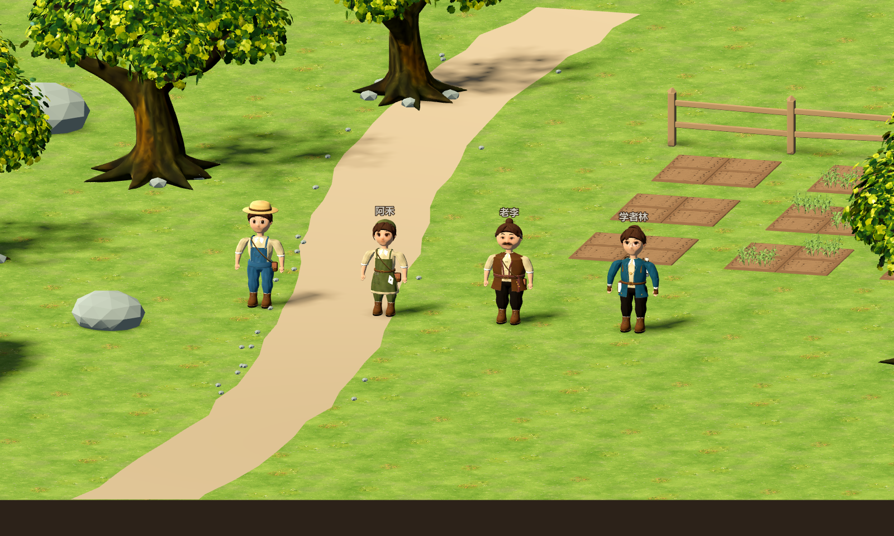
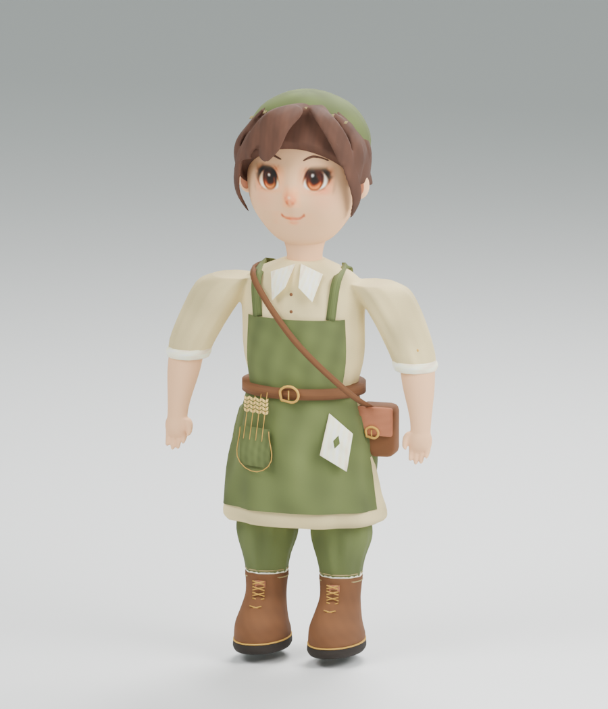
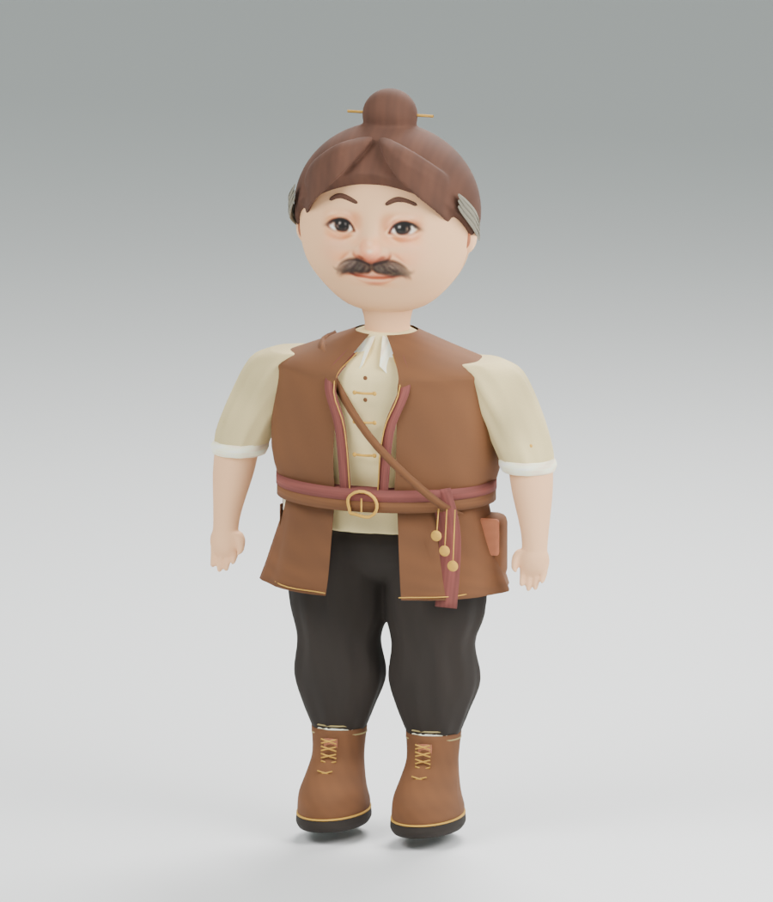
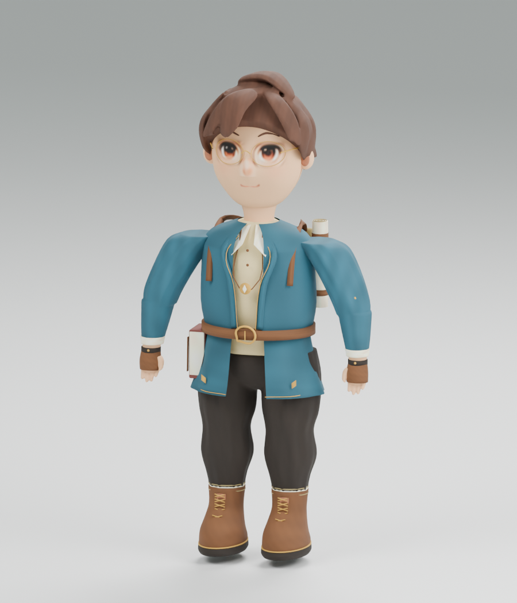
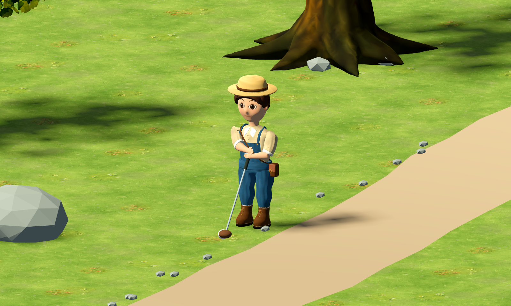
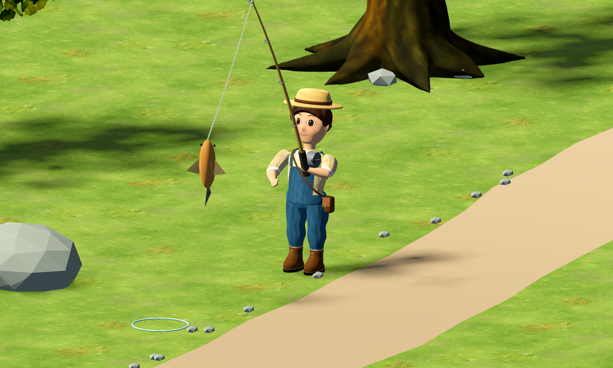

# 四人 Blender 模型与正式 3D 接入

初次接入：2026-09-09；模型重塑：2026-09-10。入口：`scenes/farm3d/main.tscn`。

玩家、阿禾、老李、学者林已换为带贴图的立体骨骼模型。NPC 沿用 `scripts/actors/npc.gd` 的寻路、日程、Agent 工作和对话逻辑，根据实际移动速度与农作执行状态切换动画。替换人物外观不需要新建存档。



## 美术与资源

本轮按原 2D 角色图重塑卡通比例。脸颊、下颌、鼻梁与眼窝使用连续表面；头发改为封闭体积和不对称发束；手掌、手指、前臂与裤腿采用融合表面，衣服改为收腰、分层下摆和布料褶皱。减少前一版球体眼睛、分段手臂和条块刘海带来的木偶感。

阿禾、老李和林的面部 UV 从原方向图采样眼睛、鼻嘴和髭须，只保留五官区域，排除原图的头发、背景与衣服。玩家原精灵图面部像素较少，依照其棕色大眼与微笑重新绘制高清五官。面部目前是静态表情，没有眨眼和口型。







| 角色 | 保留并细化的设定 | Blender 源文件 | 游戏资源 |
| --- | --- | --- | --- |
| Player | 草帽、蓝背带裤、胸袋、皮包和皮靴 | `art/blender/characters/player.blend` | `assets/models/farm3d/player_farmer.glb` |
| 阿禾 | 橄榄绿头巾、围裙、麦穗口袋、发髻、挎包 | `art/blender/characters/farmer_ahe.blend` | `assets/models/characters/farmer_ahe.glb` |
| 老李 | 较宽体型、髭须、发髻、棕色马甲、酒红腰带、账本 | `art/blender/characters/lao_li.blend` | `assets/models/characters/lao_li.glb` |
| 学者林 | 金框眼镜、蓝绿外衣、背包、卷轴、书本、指南针 | `art/blender/characters/xuezhe_lin.blend` | `assets/models/characters/xuezhe_lin.glb` |

四人共用 `assets/models/characters/village_painted_atlas.png`，2048 × 2560，包含布料织纹、皮革纹理、发色、肤色、金属配色与四个独立面部区域。GLB 用相对路径引用这张贴图，游戏中应一起保留，避免为每个人物提取重复纹理。

每个游戏模型一个网格、一个材质、12 根骨骼。基础三角面数分别为 139,636 / 136,288 / 136,534 / 128,744；Godot 导入启用自动 LOD。GLB 合计约 20.10 MiB，另有一张约 3.86 MiB 的贴图。统计由 `assets/models/characters/model_report.json` 记录。

Blender 源文件内的 `Source parts (rest pose)` 集合保留独立命名部件，默认隐藏视口和渲染，可开启后编辑。游戏导出对象是 `CharacterRig` 与 `PaintedCharacter`；源文件也保留贴图、动画与工作室相机。`art/blender/.gdignore` 防止 Godot 把源文件重复导入。

## 动作与游戏接口

- `Idle`：2 秒循环；`Walk`：1 秒循环；`Work`：1 秒工作动作，均以 30 fps 导出。
- 玩家奔跑保持 2.5 倍移动速度与动画节奏；农作将 `Work` 以 2 倍速播放，匹配原有半秒动作锁定，连续点击重新开始动作。
- NPC 在实际行走时播放 `Walk`，停下时回到 `Idle`。`NpcFarmActionVisual.is_playing()` 为真时播放 `Work`，原来的农作反馈、库存扣除与完成时机继续由原系统负责。
- 保留 `spine`、`upper_arm.L/R`、`forearm.L/R` 等原骨骼名称与关节位置，继续接受现有钓鱼、高尔夫姿势控制。
- NPC 姓名与对话提示升到头顶上方；原游戏入口仍使用其方向图，不改变原场景视觉接口。





上述近景在隔离验收场景中调用真实持杆代码，用于检查模型关节和工具位置；实际河湖钓鱼及球场操作另由流程测试覆盖。

本轮完成四名重点角色与通用动作。其余居民、表情口型、搬运和建筑生产专项动画仍记录在 TD-01。

## 重建与验证

重建脚本会重新生成四份模型、源文件和贴图。手工修改 `.blend` 后，选择游戏网格与骨骼重新导出；不要运行生成脚本覆盖需要保留的手工修改。

```powershell
& 'C:/Program Files/Blender Foundation/Blender 5.2/blender.exe' --background --python scripts/tools/build_village_characters.py
godot_console.exe --headless --path . --editor --quit
godot_console.exe --headless --path . --script tests/run_3d_character_tests.gd -- --farm-test
# 可视化验收：正面、背面、行走、农作、四人独立近景、左右手高尔夫和钓鱼近景写入 tmp/characters/
godot_console.exe --path . --script tests/run_3d_character_tests.gd -- --farm-test --capture-characters
```

2026-09-10 最终模型重新导入后实际验证（六组共 602 项；可视化运行另重复角色检查 133 项）：

| 检查 | 结果 |
| --- | --- |
| Blender 5.2 批量建模、保存、导出、渲染 | 四人全部成功 |
| Godot 4.7.1 资源导入 | 无解析或导入错误 |
| `run_3d_character_tests.gd` | 133 项通过：模型接入、共用贴图、UV、12 根骨骼、动画时长、骨骼实际运动、NPC 动作切换、连续农作、原场景兼容 |
| `run_3d_fishing_tests.gd` | 105 项通过 |
| `run_3d_golf_tests.gd` | 195 项通过，含左右手操作 |
| `run_3d_agent_tests.gd` | 57 项通过 |
| `run_farm3d_scene_tests.gd` | 52 项通过 |
| `run_3d_farm_interaction_tests.gd` | 60 项通过 |
| 游戏实际渲染检查 | 正反面、四人独立近景、行走、农作、左右手持杆、拉竿近景已检查 |

验收使用 `--farm-test`，不读写玩家正式存档，也不启动真实 Agent 请求。
