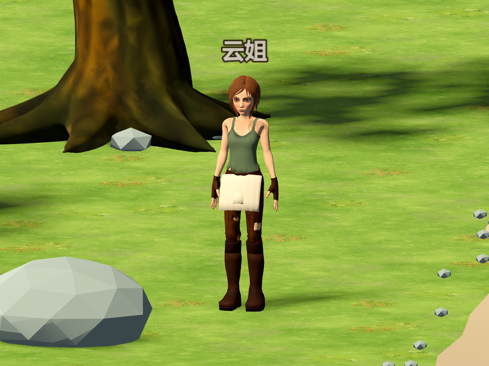

# 云姐：Sintel 女性 NPC 移植

正式场景 `scenes/farm3d/main.tscn` 中的重点居民 **云姐**（`resident_yun`）使用新模型。她保留既有厨工身份、烹饪倾向、工具权限、经济账户、合同和记忆，不新增居民或重置玩家存档。默认 36 人社会配置已将她列为重点角色；已有存档若自行调整过重点角色名单，仍沿用保存的名单。



## 游戏资产

- `assets/models/characters/resident_yun.glb`：约 7.58 MiB，55 根骨骼、76,296 个三角面、14 个蒙皮网格、11 种材质。Godot 导入开启自动 LOD。
- GLB 包含 7 张烘焙基础色贴图：身体 2048²，上衣／裤子 1024²，其余 512²；Godot 提取的 PNG 和 `.import` 随资产保留。
- 动作：Idle（3 秒）、Walk（1 秒）、Run（0.8 秒）、Work（1.6 秒）。常速走路使用 Walk；速度达到 3.5 米／秒且模型含 Run 时切换跑步。工作视觉使用双手操作动作。
- 保留 6 个表情形态键：左右微笑、抬眉和眯眼。尚未实现对话音素驱动、自动眨眼或表情调度。
- `art/blender/characters/resident_yun.blend`：整理后的可编辑模型、骨骼、贴图、动作、摄影棚和署名。
- 原始 `Sintel Lite 2.57b/bendansie_sintel_lite_257b.blend` 保留原样。

导出移除了旧版控制骨、约束、驱动脚本和变形笼。原身体的大部分四肢权重位于变形笼中，转换时先传递这些权重，再合并分段骨和控制骨；衣服、靴子也使用实际蒙皮。围裙和口袋按髋部／大腿混合权重随步伐变形。

此版本的 Work 已接入原 NPC 工作视觉接口；普通市场采购、机器自行加工等待等行为仍按原系统决定是否播放动作，不改动生产完成条件。云姐不是玩家，尚未针对该骨架校准玩家钓鱼／高尔夫的握杆姿态。

## 实机检查


`tests/run_3d_sintel_npc_tests.gd` 验证原身份、材质贴图、55 骨骼、表情导入、动作切换、实际腿部骨骼运动、Agent 寻路到达、完整存读档后的资源一致性、对话开关与暂停恢复，共 60 项检查。使用隔离的 P12 配置与 `tmp/sintel-yun-test-save.json`，不访问玩家主存档或在线模型。

本次验证结果：云姐专项 60 项、原角色 133 项、3D Agent 58 项、P12 社会 51 项，共 302 项检查通过。

```powershell
godot_console.exe --headless --path . --script tests/run_3d_sintel_npc_tests.gd -- --farm-test --living-world-scenario=P12
```

另以真实 OpenGL 渲染检查正面、背面、行走和工作姿态。截图模式附加 `--capture-yun`，移除 `--headless`。

## 重新生成

```powershell
& 'C:/Program Files/Blender Foundation/Blender 5.2/blender.exe' --background --disable-autoexec --python scripts/tools/build_sintel_npc.py
godot_console.exe --headless --editor --path . --quit
```

脚本读取原文件、生成独立游戏资产和派生 `.blend`，不执行原文件内嵌的旧版 Python 脚本。预览输出到 `tmp/sintel-yun/`。

原模型 **Sintel Lite 2.57b** 作者为 **BenDansie**，采用 CC BY 3.0。来源、许可链接和改造说明见 [SINTEL_LICENSE.md](../../assets/models/characters/SINTEL_LICENSE.md)，发布角色时一并保留署名。
