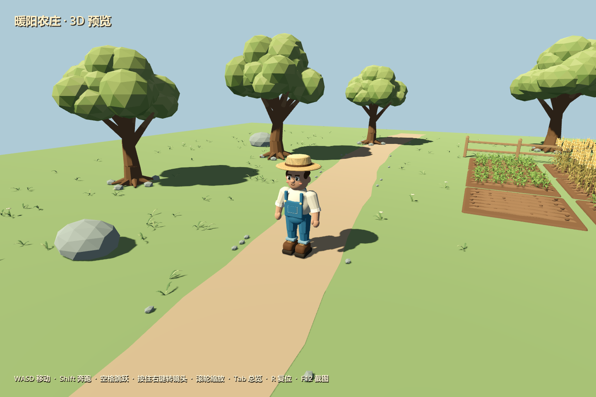

# 3D 农庄验证记录

项目默认入口已经切换到 `scenes/farm3d/main.tscn`。当前版本包含新橡树、手绘草地、动态田块和原种植生命周期，运行方式、控制与最新验证结果见 [3D 草地与种植集成验证](3d-farming-integration.md)。

模型源文件及生成方式见 `assets/models/farm3d/README.md`。`farm_3d_blender_player.png` 和 `farm_3d_blender_overview.png` 为前期 Blender 建模阶段的留档；运行时草地和农田以最新 Godot 截图为准。

