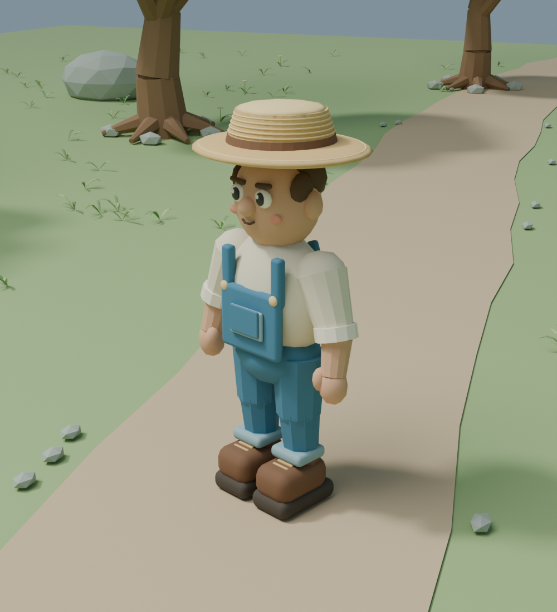

# 3D 农庄模型预览验证

日期：2026-09-06。分支：`feature/3d-farm-preview`，基于 `main` 的 `e6449e6`。

## 打开预览

项目根目录运行：

```powershell
./tools/preview_3d.ps1
```

WASD 移动，Shift 奔跑，空格跳跃，按住右键转镜头，滚轮缩放，Tab 切换总览，R 角色复位，Esc 释放鼠标，F12 截图到 `user://farm_3d_preview.png`。Godot 编辑器也可打开 `scenes/preview/farm_3d_preview.tscn` 后按 F6。

模型源文件：`art/blender/farm_preview.blend`。资产清单与重新生成方法见 `assets/models/farm_preview/README.md`。

## 已验证

- Blender 5.2.1 LTS 后台生成成功；源文件重新打开成功，保留 8 个命名集合和 Idle / Walk 动画。
- Godot 4.7.1 完成最终六个 GLB 资源导入，无脚本或资源加载错误。
- `godot_console.exe --headless --path . --script tests/run_farm_3d_preview_tests.gd`：18 项通过，涵盖实际网格/动画导入、循环动画、落地、移动、跳跃、田地高度、镜头碰撞回缩与恢复、视角切换、跌落复位。
- `godot_console.exe --headless --path . --script tests/run_player_logic_tests.gd`：35 项通过。
- 通过专用 PowerShell 启动脚本生成总览截图，退出码 0；实际 OpenGL Compatibility 渲染使用 NVIDIA GeForce RTX 4080 SUPER。
- 无显示服务时请求截图返回退出码 1，不会把未生成截图报告为成功。
- 原 `project.godot`、主场景、玩家游戏逻辑没有修改。

## 实际效果

Godot 总览：


Godot 第三人称镜头：


Blender 角色近景（光照与游戏中不同）：



首轮为模型与操控预览。种植、收获、工具动作和 NPC Agent 尚未接入；角色使用分部刚性权重，树干与树冠采用近似碰撞。场景环境为一个合并静态网格（21 个材质表面，约 26.5 MiB），并非大世界分块/LOD 性能方案。此次执行定向验证，没有重跑整个项目测试集。
