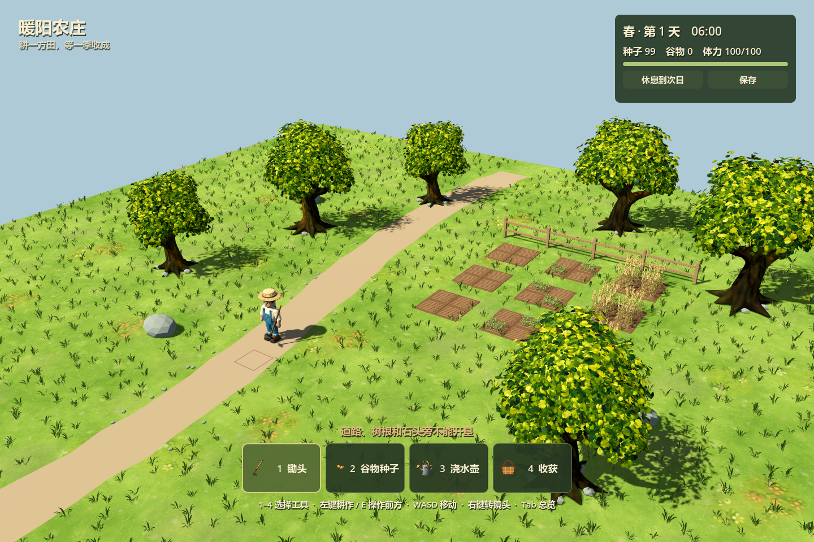
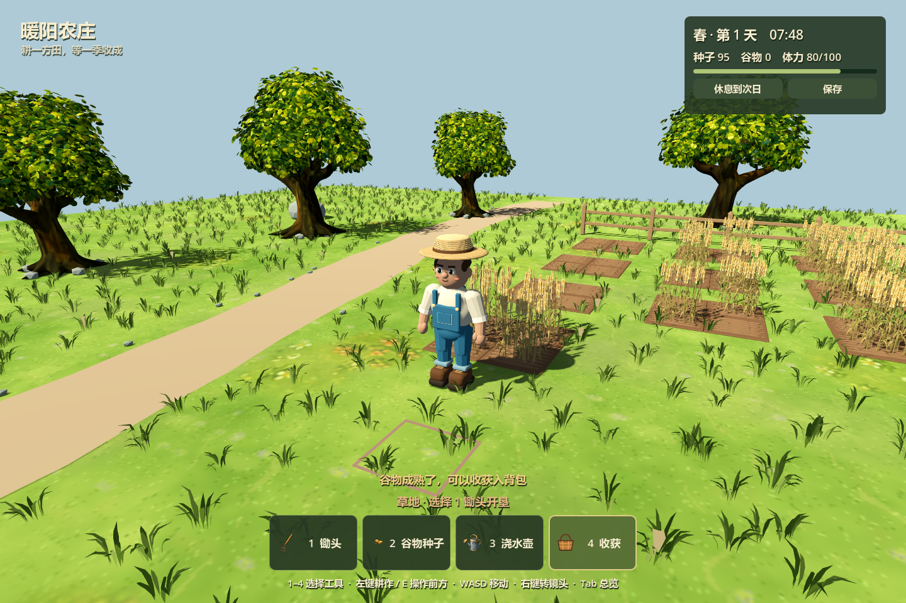
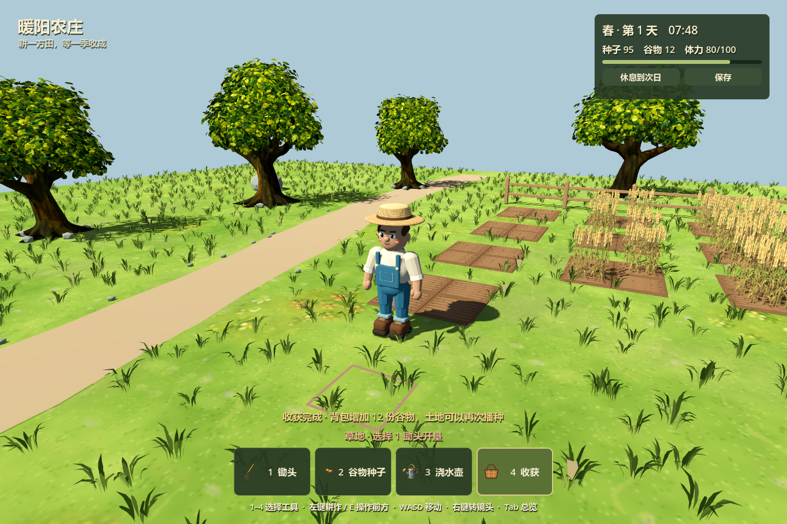

# 3D 草地与种植集成验证

日期：2026-09-06，分支：`feature/3d-farm-preview`。

## 运行与操作

从根目录打开 Godot，F5 启动当前 3D 农庄。也可运行 `./tools/preview_3d.ps1`。

| 操作 | 按键 |
| --- | --- |
| 选择锄头 / 谷物种子 / 浇水壶 / 收获 | 1 / 2 / 3 / 4，或点击底部按钮 |
| 对近处鼠标指向的格子操作 | 左键，最大距离 2.6 米 |
| 对角色前方格子操作 | E |
| 移动 / 奔跑 / 跳跃 | WASD / Shift / 空格 |
| 转镜头 / 缩放 / 总览 | 按住右键 / 滚轮 / Tab |
| 恢复体力并推进一天 | 右上角“休息到次日” |
| 保存 | 右上角“保存”，另有操作后、每 15 秒及关窗自动保存 |

新档提供 99 粒谷物种子和九组可交互示范田。谷物春夏秋可种，沿用原来的 108 游戏分钟成熟时长（正常流速约 30 秒），浇水按原规则加快生长。每次收获 2–4 份谷物并获得原经验奖励，收获后的土块可以再种。锄头消耗原有体力和耐久；冬季谷物枯萎。选择收获可以徒手清理枯萎作物，不增加谷物或经验。

存档是独立的 `user://farm_3d_save.json`，保存格子、作物进度/生命周期、种子和谷物库存、时间季节、工具耐久、体力、经验等级及收获随机种子。写入临时文件完成后替换正式文件，原游戏存档不受影响。测试和截图禁用用户存档读写；截图使用 `--farm-test`。

## 资产与规则

- 地表采用原手绘草地贴图，立体草丛和小花由共享网格/MultiMesh 生成。锄地的状态事件会隐藏对应格子内的草丛。
- 静态环境移除了写死的田块和谷物，GLB 从约 26 MB 缩小到约 220 KiB；作物和土块按游戏状态实例化。
- 格子为原来的 1 米尺度；道路、橡树根部、石头和围栏占地禁止开垦。
- 原 `GridSystem`、`FarmingSystem`、`SeasonSystem`、`InventorySystem`、`ToolSystem` 和动作事务继续负责规则。作物定义从 Main 提取到共享 `CropCatalog`，2D 和 3D 使用同一份数据。
- 3D 视觉适配层显示种粒、幼苗、长高的植株、成熟麦穗和枯萎植株；不会生成旧的二维作物或回退方块。

## 验证结果

Godot 4.7.1 Compatibility 导入无脚本/资源错误。定向检查：

| 命令中的测试脚本 | 结果 |
| --- | --- |
| `tests/run_3d_farming_tests.gd` | 45 项通过：原分钟生长、库存/经验事务、季节、枯萎、范围、存档恢复与失败回滚 |
| `tests/run_3d_farm_interaction_tests.gd -- --farm-test` | 23 项通过：实际场景、鼠标选格/点击开垦、数字键、草丛隐藏、种植收获、按钮和休息 |
| `tests/run_3d_meadow_tests.gd` | 4 项通过：草丛位置与格子遮罩一致 |
| `tests/run_farm_3d_preview_tests.gd` | 44 项通过：移动、落地、田地碰撞、六棵橡树和镜头 |
| `tests/run_painted_oak_tests.gd` | 14 项通过：模型、手绘材质、碰撞、预览 |
| `tests/run_farming_system_tests.gd` | 原种植系统 1837 项通过；保留原测试的故意资源回退警告及退出时 3 个对象泄漏提示 |

实际 GPU 运行并截取开垦、播种、生长、成熟、收获五个阶段，使用 NVIDIA RTX 4080 SUPER / OpenGL Compatibility。复现：

```powershell
godot_console.exe --path . --resolution 1440x960 --script tests/capture_3d_farming_lifecycle.gd -- --farm-test
```







当前迁入的是玩家种植流程；NPC Agent、市场、建筑及完整经济循环仍在原游戏中。
