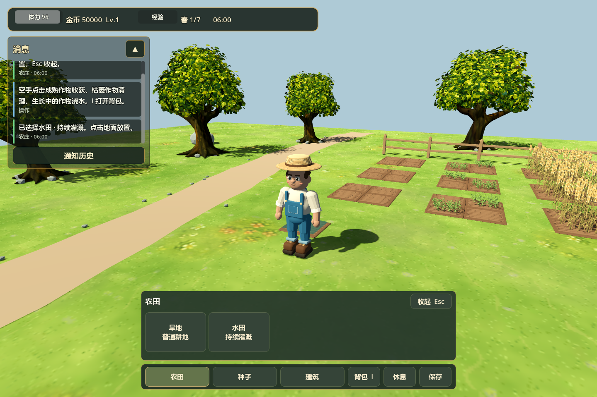
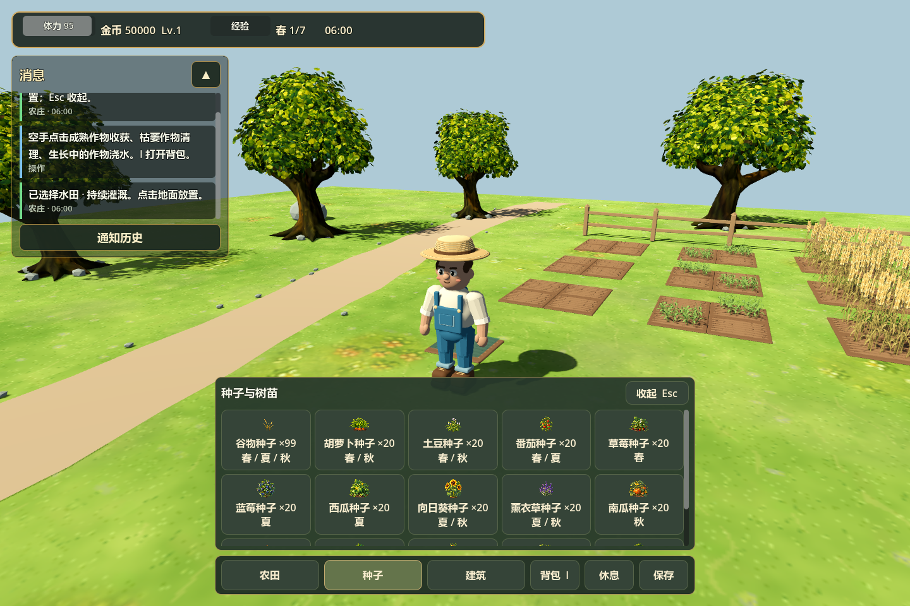
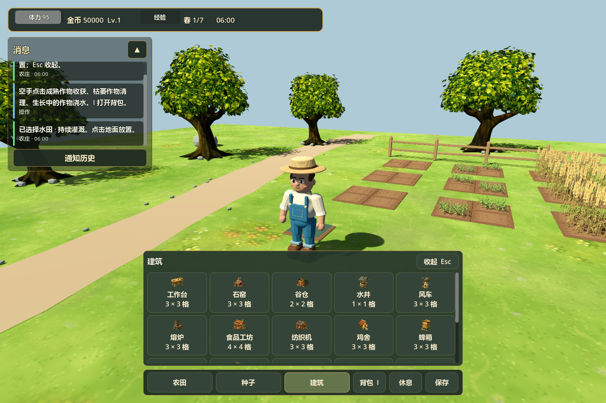
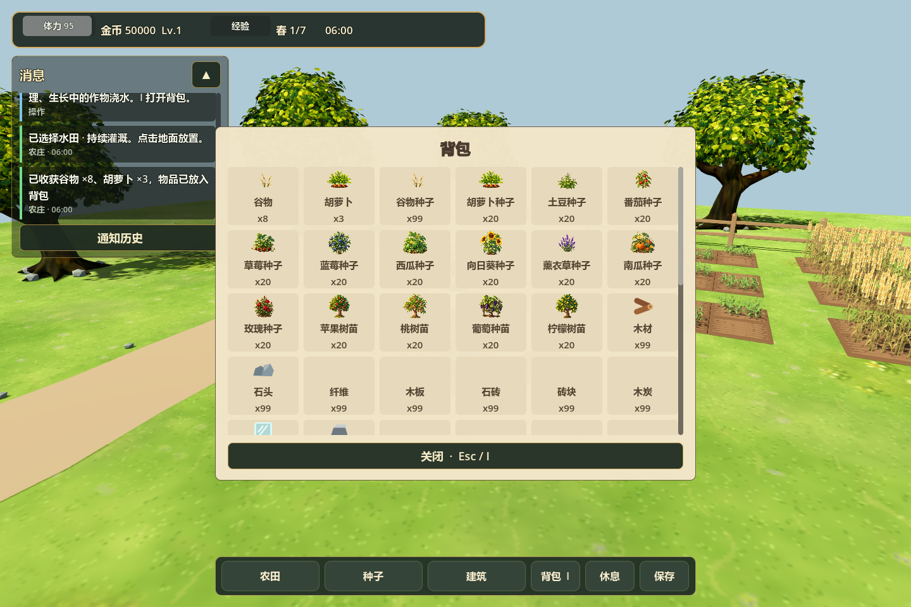

# 3D 农庄：目标菜单与背包集成

日期：2026-09-06，分支：`feature/3d-farm-preview`。

## 运行与操作

正式入口为 `scenes/farm3d/main.tscn`，场景与玩家脚本位于 `scripts/farm3d/`。完整目录分工见[根目录说明](../../README.md)。

从根目录打开 Godot，F5 启动当前 3D 农庄；也可运行 `./tools/run_farm3d.ps1`。

| 操作 | 行为 |
| --- | --- |
| 农田 → 旱地 / 水田 | 选择目标，鼠标指向地面显示方格，左键开垦；空田可切换类型 |
| 种子 → 具体种子 / 树苗 | 原游戏全部 15 种，显示库存和适宜季节；左键播种 |
| 建筑 → 具体建筑 | 原游戏全部 17 种，显示占地，消息面板说明材料；左键放置并开始施工 |
| 空手点击生长中的作物 / 空农田 | 浇水 |
| 空手点击成熟 / 枯萎作物 | 收获入背包 / 清理，清理不增加库存或经验 |
| Esc | 取消所有目标、方格与建筑预览，关闭二级菜单和背包，恢复行走 |
| I / 背包按钮 | 打开、关闭背包；收获物优先显示，点击种子可直接选为种植目标 |
| E | 对前方地块执行当前目标或空手操作 |
| WASD / Shift / Space | 行走 / 奔跑 / 跳跃 |
| 右键拖动 / 滚轮 / Tab | 旋转镜头 / 缩放 / 总览 |
| 休息 / 保存 | 推进到次日并恢复体力 / 保存农庄 |

二级菜单选定具体目标后自动收起，为鼠标操作腾出地面。再次点击大类可以重新选择。角色始终从空手行走状态进入游戏，工具选择按钮已移除。

## 迁入内容

- 左上角状态条复用原 HUD 的主题与状态组件，显示体力、金币、等级、经验、季节、日期和时间。
- 消息面板复用 `HudMessageBus` / `HudMessageStream`；操作结果、失败原因、季节变化和成熟提醒集中显示，支持收起和历史记录。修正长消息布局后自动滚动的位置。
- 背包继承原 `InventoryUI`，使用同一个 `InventorySystem`。容量 60 格，支持滚动，显示物品图标、名称、数量，隐藏旧工具快捷栏。
- 全部作物共用原 `CropCatalog`、`FarmingSystem` 与季节规则；谷物保留新 3D 模型，其余种类移入原手绘作物场景，尚未重新制作独立 Blender 模型。
- 水田显示浅水并接入持续灌溉判断。旱地沿用普通耕地规则。开垦消耗 5 体力，手动浇水消耗 2 体力，不再要求选择或修理工具。
- 建筑复用原建造、资源消耗、施工与生产系统，以及原建筑场景。温室完成后周围八格支持反季节作物和柠檬。建筑预览检查范围与角色占地，角色、跟随镜头识别原建筑碰撞层。
- 草地保留原手绘贴图，不生成杂草或小花。

新农庄提供谷物种子 99、其余种子和树苗各 20、原新游戏建造材料各 99，以及原新游戏 50,000 金币。建筑仍保留原地理限制，例如水车要求天然水域；当前预览地图没有天然水域。

## 存档

独立使用 `user://farm_3d_save.json`，写临时文件完成后替换。v2 保存原网格、作物进度、库存、时间、体力经验等内容，并增加水田类型、建筑及施工状态、生产状态、金币。兼容 v1 3D 存档：保留原农庄与收获库存，并一次性补充新增目录的种子和材料；再次读取 v2 不会重复补充。原 2D 存档不受影响。

NPC Agent、市场、建筑经营面板和完整经营界面的移植不属于此次菜单改造。

## 验证

使用 Godot 4.7.1 Compatibility。

| 测试脚本 | 结果 |
| --- | --- |
| `run_3d_farm_interaction_tests.gd` | 37 项：真实鼠标地块点击、两级菜单、滚动后建筑按钮点击、防穿透、Esc、背包、消息滚动和行走 |
| `run_3d_target_system_tests.gd` | 107 项：全部 15 种作物、水田、季节、温室建造与柠檬、资源消耗、v1/v2 存档 |
| `run_3d_farming_tests.gd` | 45 项：分钟生长、库存与经验事务、失败回滚、存档 |
| `run_3d_meadow_tests.gd` | 3 项：保留手绘地表，无杂草 |
| `run_farm3d_scene_tests.gd` | 44 项：移动、跳跃、地面碰撞、橡树与镜头 |
| `run_hud_shell_tests.gd` | 38 项：原 HUD 和消息组件 |
| `run_inventory_storage_ui_tests.gd` | 61 项：原背包与仓库界面 |
| `run_building_system_tests.gd` | 3461 项：原建筑系统；包含故意缺失美术资产的回退警告 |

运行命令：

```powershell
godot_console.exe --headless --path . --script tests/run_3d_target_system_tests.gd -- --farm-test
godot_console.exe --headless --path . --script tests/run_3d_farm_interaction_tests.gd -- --farm-test
godot_console.exe --path . --resolution 1440x960 --script tests/capture_3d_target_menu.gd -- --farm-test
```

截图使用实际 GPU（NVIDIA RTX 4080 SUPER），测试和截图不读写玩家存档。





