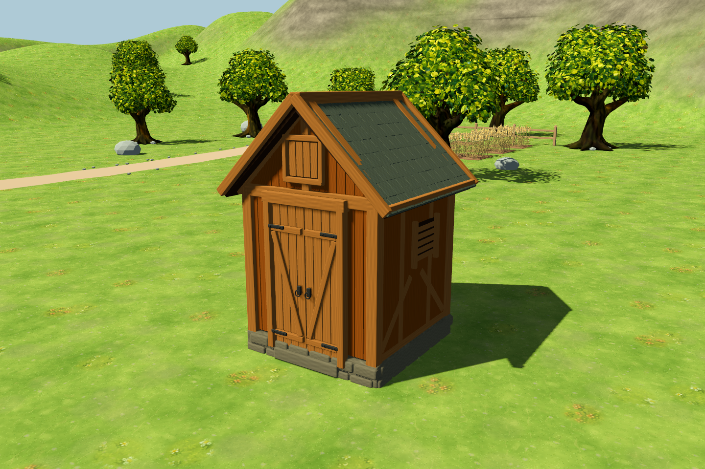
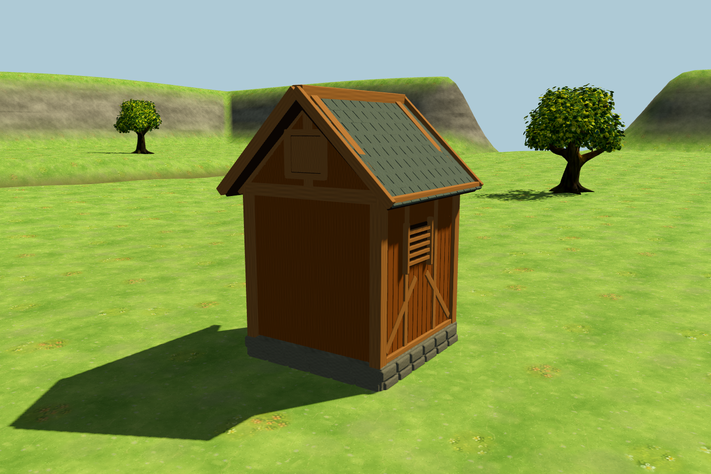
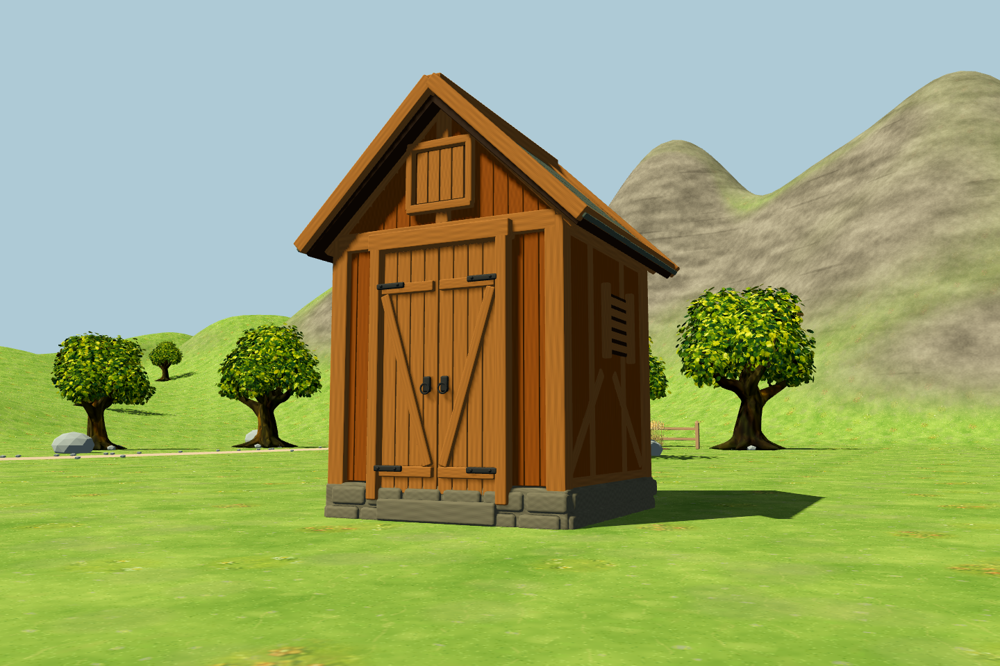
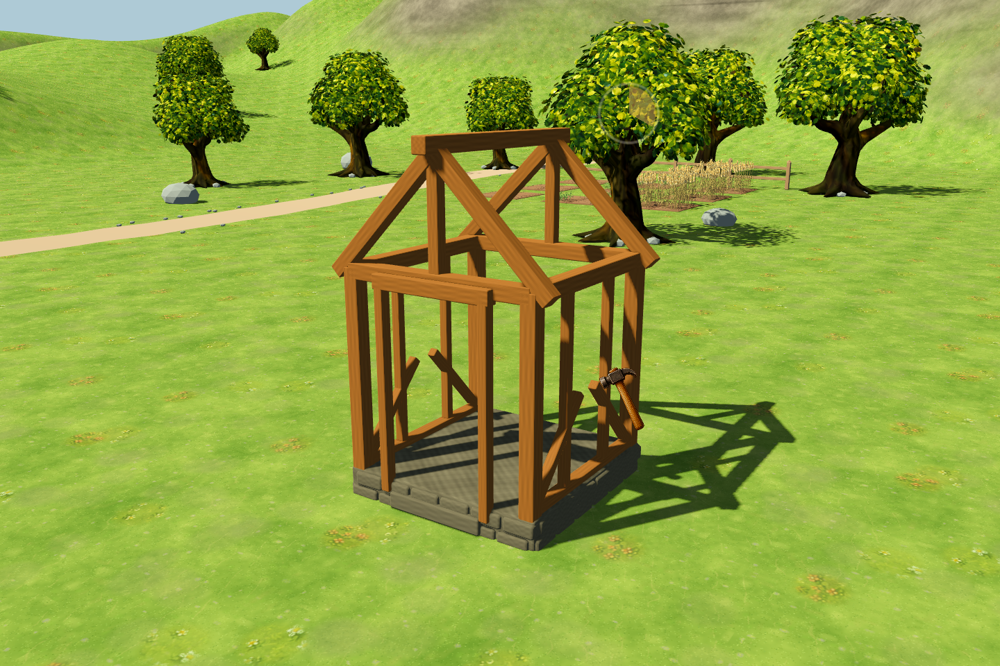
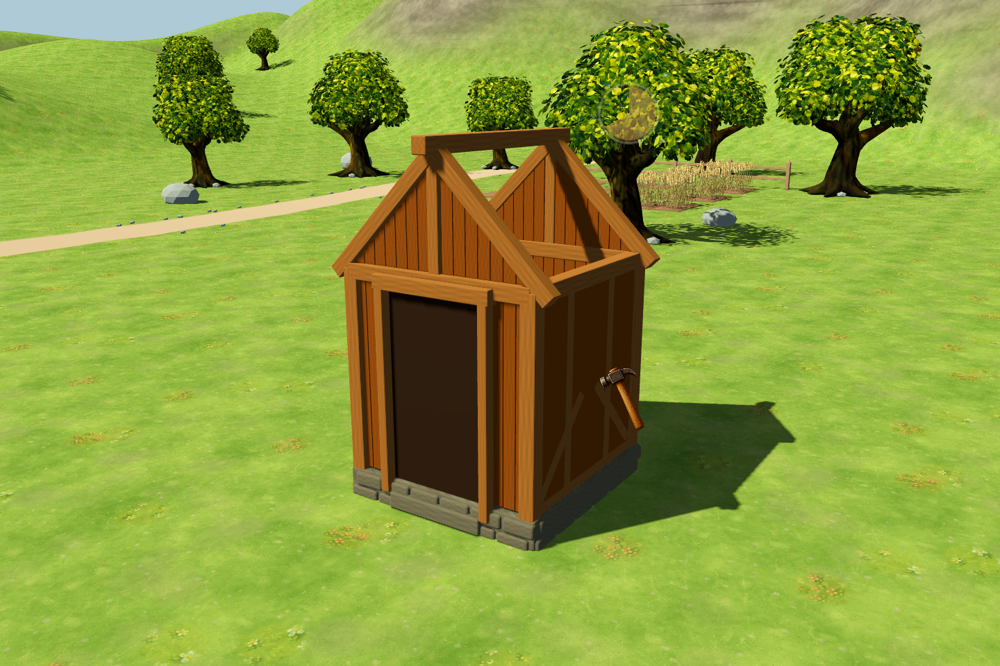

# 3D 谷仓

在正式游戏的「建筑 → 谷仓」中放置。已存在的谷仓在下次加载存档时自动使用新的 Blender 模型，无需拆除重建。





谷仓主体和施工阶段使用原生网格，不再显示原来的建筑图片。角色碰撞包含墙体和坡屋顶，相机使用独立的建筑碰撞，避免进入模型内部。放置预览使用相同模型，并按可建造状态显示绿色或红色。




源文件：[barn.blend](../../art/blender/barn.blend)。[资产结构与生成方式](../../assets/models/buildings/barn/README.md)。

```powershell
godot_console.exe --headless --path . --script tests/run_3d_barn_tests.gd -- --farm-test
godot_console.exe --path . --script tests/capture_3d_barn.gd -- --farm-test
```

专项检查覆盖原目录与费用不变、原生模型预览、施工阶段、贴地尺寸、旋转相机不改变模型、墙体与屋顶碰撞、相机避让，以及施工中／已完工谷仓的存档恢复。截图使用正式场景渲染，测试均禁用玩家存档读写。
