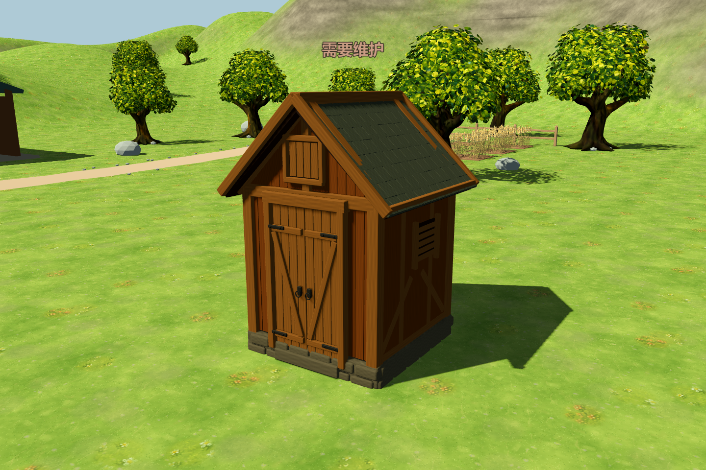

# 3D 谷仓

在正式游戏的「建筑 → 谷仓」中放置。已存在的谷仓在下次加载存档时自动使用新的 Blender 模型，无需拆除重建。


谷仓主体和施工阶段使用原生网格，不再显示原来的建筑图片。角色碰撞包含墙体和坡屋顶，相机使用独立的建筑碰撞，避免进入模型内部。放置预览使用相同模型，并按可建造状态显示绿色或红色。

维护到期时，旧版裂纹、碎木和石块图片曾以不受深度遮挡的方式覆盖立体模型，导致一座到期谷仓看起来像混入杂物，另一座未到期谷仓则正常。3D 谷仓现在使用屋顶上方的维护状态文字，保留原维护规则；提示遵守深度遮挡，维护完成后短暂显示“维护完成”并自动消失。




源文件：[barn.blend](../../art/blender/barn.blend)。[资产结构与生成方式](../../assets/models/buildings/barn/README.md)。

```powershell
godot_console.exe --headless --path . --script tests/run_3d_barn_tests.gd -- --farm-test
godot_console.exe --path . --script tests/capture_3d_barn.gd -- --farm-test
godot_console.exe --path . --script tests/capture_3d_barn.gd -- --farm-test --maintenance-only
```

专项检查覆盖原目录与费用不变、原生模型预览、施工阶段、贴地尺寸、旋转相机不改变模型、墙体与屋顶碰撞、相机避让，以及施工中／已完工谷仓的存档恢复。截图使用正式场景渲染，测试均禁用玩家存档读写。

维护显示修复验证：`run_3d_barn_tests.gd` 148 项通过，包含警告／到期／维护中／完成显示和状态切换；`run_3d_target_system_tests.gd` 107 项通过。另以只读方式加载现有两座谷仓的存档，确认到期与正常状态都使用相同的完整模型。
