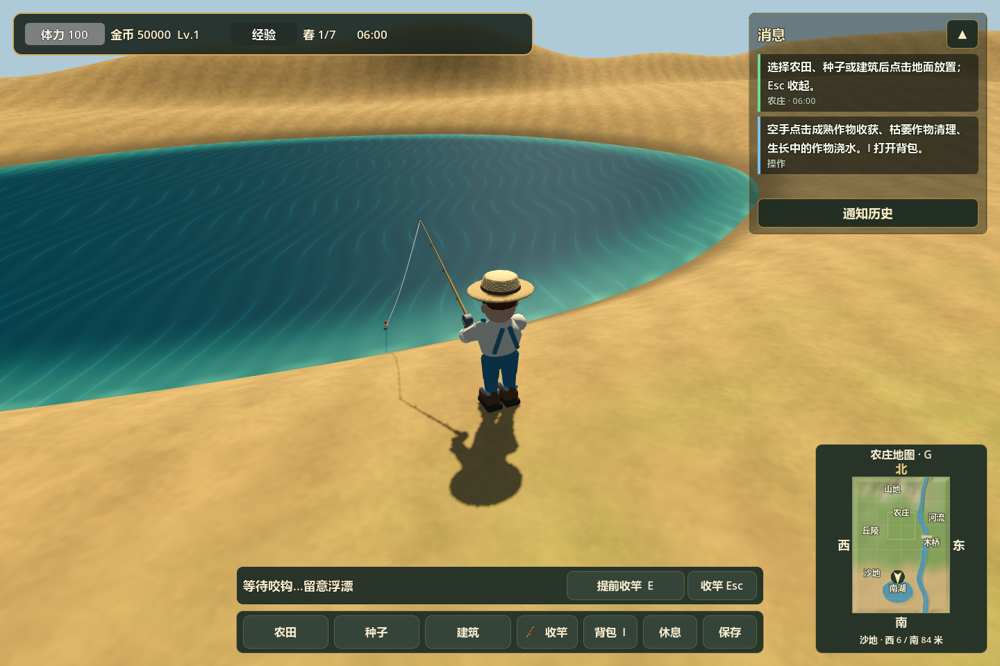
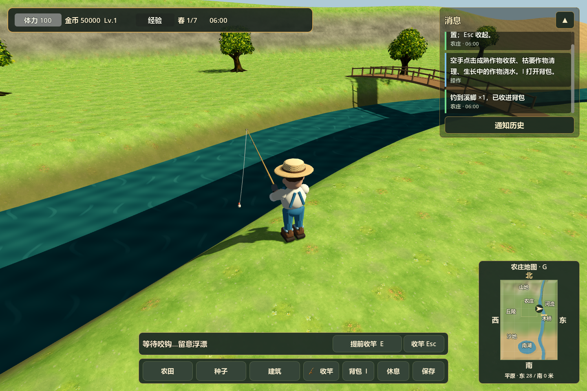
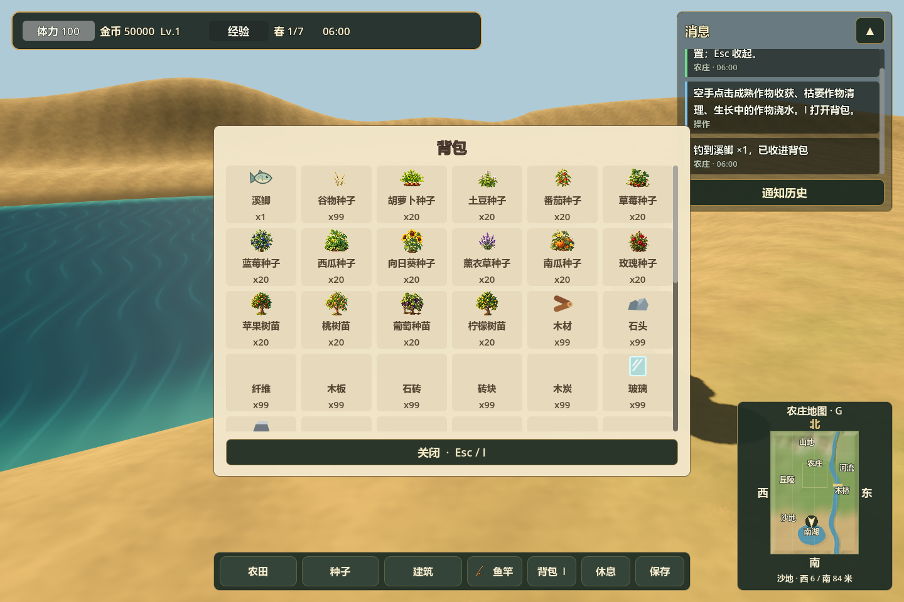
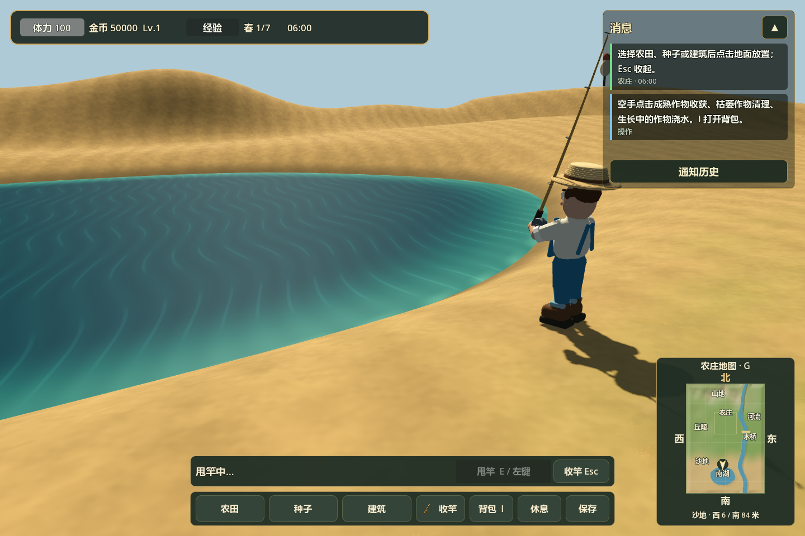
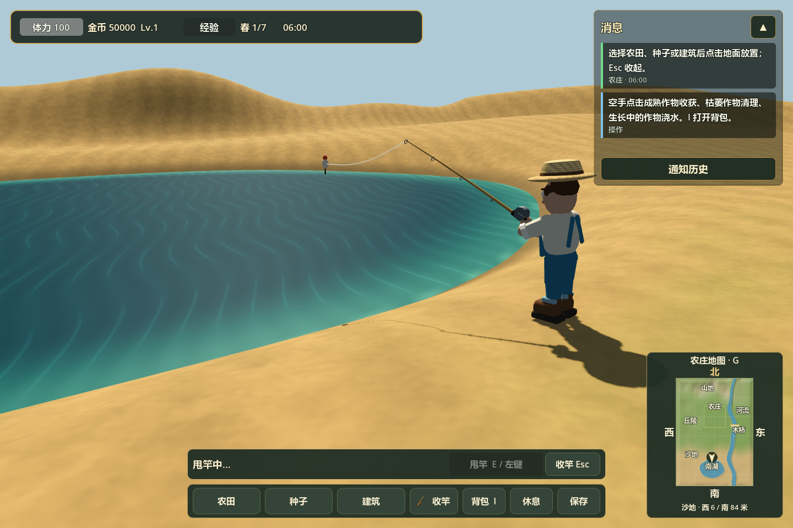
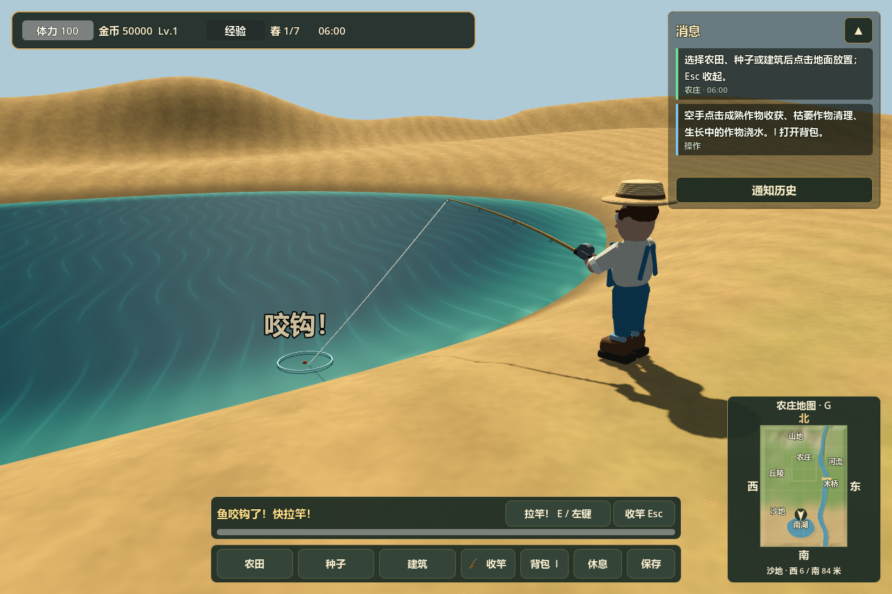
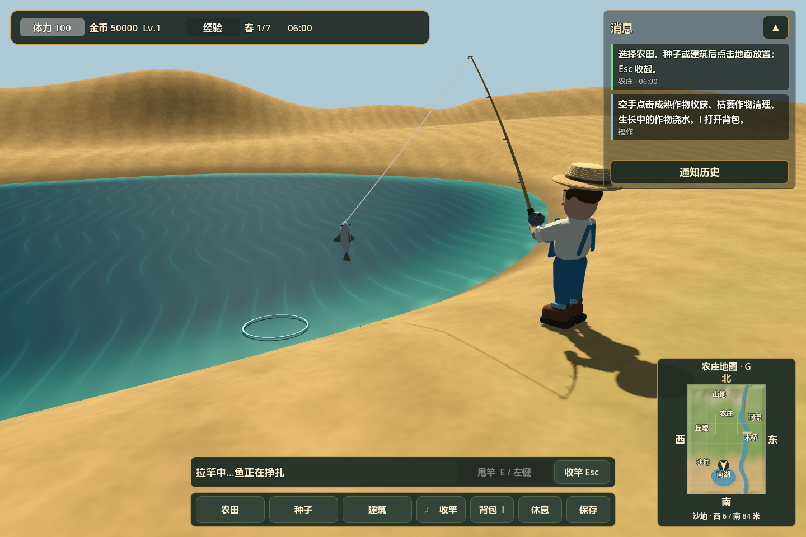
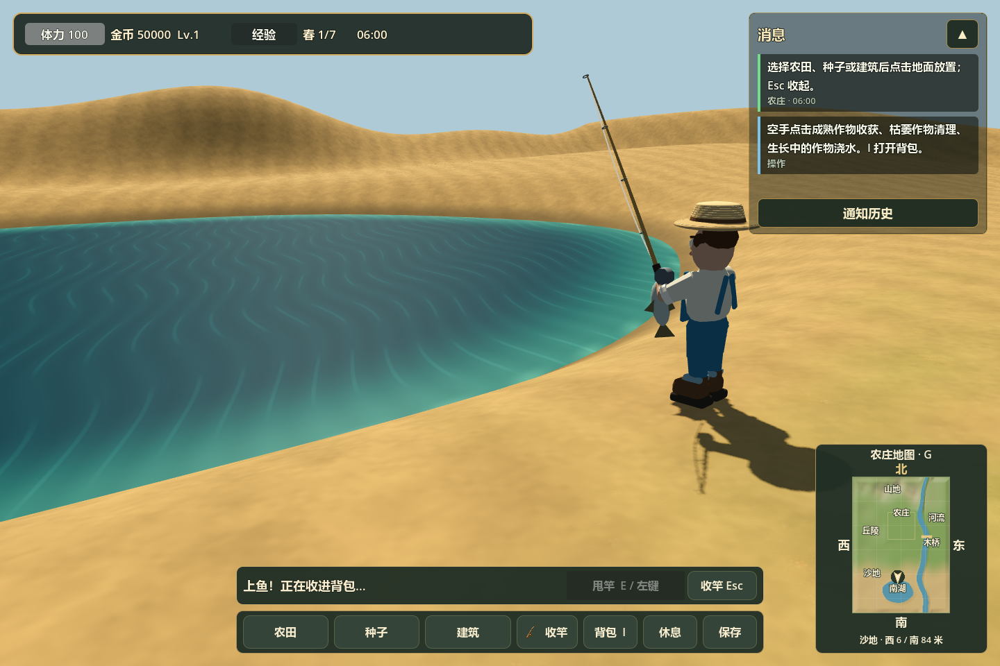

# 3D 河湖钓鱼

正式入口 `scenes/farm3d/main.tscn` 已支持从选位、选择鱼竿到渔获入包的完整流程。基础鱼竿为内置工具，不消耗鱼饵，也不需要先购买。

## 操作

1. 走到干燥平缓的河岸或湖岸，靠近水面。工具栏“鱼竿”由灰变亮后可以选择；不合适的位置会禁用按钮。
2. 选择鱼竿后人物朝向可投掷的水面，双手持竿，镜头转到肩后观察浮漂的位置。钓鱼姿态下暂停移动和跳跃，按 Esc 收竿后恢复。
3. 按 E、鼠标左键或面板“甩竿”按钮。角色向后蓄力再向前甩竿，浮漂沿弧线飞出，鱼线展开。
4. 等待 3～7 秒。每竿有 72% 概率咬钩；空竿会提示并收线，可再次甩竿。咬钩时浮漂下沉震动、水面起涟漪、竿尖弯曲，显示“咬钩！”和倒计时条。
5. 在 2.2 秒内按 E／左键拉竿。人物抬竿并转动绕线轮，鱼在线上挣扎出水，随后收至手边；动画结束自动加入背包，消息显示鱼种和数量。

等待时提前收线、错过咬钩均不会获得鱼。Esc、切换种植／建筑目标、打开背包／消息历史、休息、返回农庄、失去窗口焦点或离开站位，会安全结束当前钓鱼。G 仍可开关小地图，右键拖动仍可观察周围。



## 位置和渔获

位置检测覆盖河流和湖泊，不依赖固定钓位列表。站位须位于地图内的干燥地面、坡度不超过 0.65，脚下与地形高度一致且站稳；水面需在 12 米以内，落点水深至少 0.55 米，抛线不能穿过地形、树冠或建筑。桥上、水中和高峡谷边缘不开放钓鱼。

可先体验南湖北岸 `(-6,84)`、西岸 `(-40,108)`、南岸 `(-6,132)`，或河流西岸约 `(28,0)`。

| 水域 | 渔获权重 |
| --- | --- |
| 河流 | 溪鲫 50、河鲈 35、虹鳟 15 |
| 湖泊 | 鲤鱼 50、溪鲫 35、夜鲶 15 |

当前鱼种按水域加权选择，全天均可钓；每次成功获得 1 条。共用已有鱼类物品定义与叠加规则，背包优先显示渔获并配有鱼图标。




## 模型与动作

`fishing_visual.gd` 生成原生 Godot 网格：12 节渐细竹竿、软木握柄、金属线轮与摇柄、4 个导线环、28 段有厚度的动态鱼线、红白浮漂，以及带尾鳍、背鳍、侧鳍和眼睛的鱼。不同鱼种使用不同体色。

复用现有农夫骨骼，以双臂 IK 控制握竿和收鱼位置，并配合脊柱倾斜、竿身弯曲、浮漂轨迹与鱼的挣扎实现甩竿、等待、咬钩、拉竿和上鱼动作。收竿后恢复原 Idle／Walk 动画与 Shift 奔跑。







## 结算与验证

3D 状态机在 `farm_fishing.gd`，位置规则在 `fishing_location.gd`，通过现有交互层与 HUD 接入。沿用共用背包的容量预留机制：甩竿前预留一条鱼的空间，背包满则不能甩竿；失败、取消或卸载释放预留，收鱼动画结束只提交一次。渔获进入现有 3D 存档并触发自动保存；进行中的抛竿不持久化，加载有效存档前会结束钓鱼。

```powershell
godot_console.exe --headless --editor --path . --quit
godot_console.exe --headless --path . --script tests/run_3d_fishing_tests.gd -- --farm-test
godot_console.exe --headless --path . --script tests/run_farm3d_scene_tests.gd -- --farm-test
godot_console.exe --headless --path . --script tests/run_3d_farm_interaction_tests.gd -- --farm-test
godot_console.exe --headless --path . --script tests/run_3d_minimap_tests.gd -- --farm-test
godot_console.exe --path . --script tests/capture_3d_fishing.gd -- --farm-test
```

钓鱼专项 105 项检查覆盖河湖可用位置、错误站位／障碍、真实按键和鼠标输入、角色姿态锁定、随机空竿与咬钩、提前拉竿／超时、动画完成后单次入包、取消释放容量、背包满、窗口失焦、位移取消和保存恢复。场景 52 项、目标交互 44 项、小地图 22 项、种植建造与存档 107 项、地形 64 项、南湖 52 项回归检查通过。截图脚本从正式场景捕获 11 个视角／阶段；所有测试与截图均使用隔离模式，不读写玩家存档。
