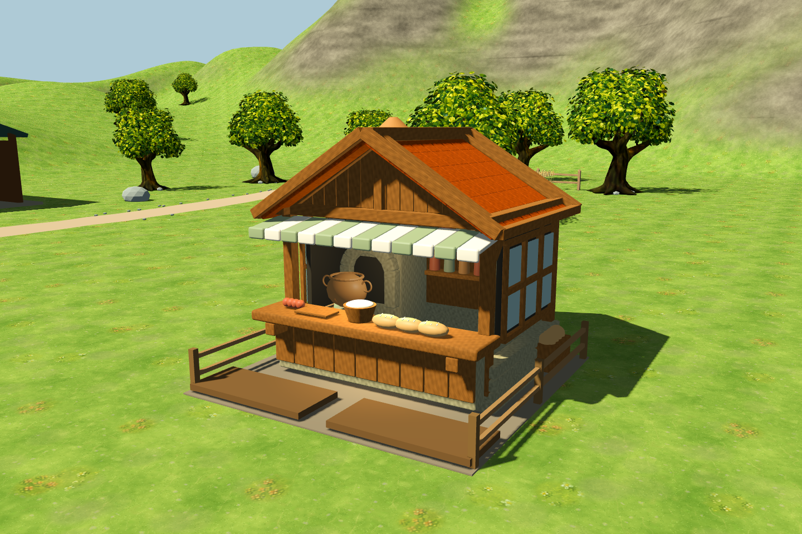
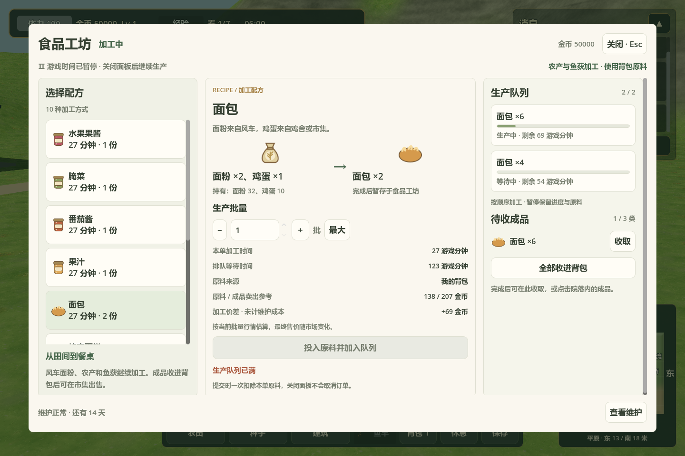

# 3D 食品工坊与原生产链

正式入口：`scenes/farm3d/main.tscn`。从建筑菜单放置食品工坊，沿用原来的 4×4 占地和木板 12、石砖 8、玻璃 5、铁锭 2 的建造成本。

## 操作

1. 完工后走到南面的操作台前，左键点击建筑。
2. 在可滚动的配方列表选择产品，设置批量；面板显示本单原料、持有数量、时间及当前行情估算。
3. 点击“投入原料并加入队列”，按原规则一次扣除本单原料。最多两笔订单顺序加工。
4. 按 Esc 关闭面板，游戏时间恢复，工坊继续生产并冒出蒸汽。
5. 点击院落成品，或在面板逐类／全部收进背包，再带到市集出售。背包装不下时不会丢失成品。

打开面板暂停游戏时间；配方／加工／队列在窄屏下切换为页签。输出默认容纳三类物品，同类可叠加；满仓阻塞时保留订单，收取后继续。维护周期、扣费、暂停和恢复均沿用原生产系统。

## 配方与上下游

配方直接来自原 `RecipeDatabase`，不在 3D 层复制生产规则。

| 每批投入 | 每批产出 | 游戏分钟 |
| --- | --- | --- |
| 草莓 ×2、蜂蜜 ×1、玻璃罐 ×1 | 果酱 ×1 | 27 |
| 胡萝卜 ×3、盐 ×1、玻璃罐 ×1 | 腌菜 ×1 | 27 |
| 番茄 ×3、玻璃罐 ×1 | 番茄酱 ×1 | 27 |
| 草莓 ×3、玻璃瓶 ×1 | 果汁 ×1 | 27 |
| 面粉 ×2、鸡蛋 ×1 | 面包 ×2 | 27 |
| 面粉 ×2、鸡蛋 ×1、蜂蜜 ×1 | 蜂蜜蛋糕 ×1 | 27 |
| 普通鱼 ×2、盐 ×1 | 烤鱼 ×2 | 27 |
| 普通鱼 ×2、盐 ×1、玻璃罐 ×1 | 腌鱼 ×1 | 27 |
| 玫瑰 ×2、玻璃瓶 ×1 | 香水 ×1 | 36 |
| 玫瑰 ×3、纤维 ×1 | 花束 ×1 | 36 |

谷物在风车加工为面粉，再送入食品工坊制作面包和蛋糕。河流、湖泊钓到的普通鱼可加工为熟食；沿用原系统的普通鱼选择器，支持混合鱼种，面板显示实际将消耗的鱼种。稀有鱼不会被消耗。缺少普通鱼时禁用开工，并暂不显示不完整的成本估算。

原料扣除、队列、时间推进、输出收取和维护继续调用共享 `ProductionSystem`。成品进入同一背包，并通过原市场的供需、库存和批量报价出售；不存在单独的工坊钱包或另一套食品价格。

## 模型

参考原食品工坊图片的木石结构、橙色陶瓦屋顶、绿白遮阳棚和开放式厨房。模型包含独立瓦片、木梁、山墙、格窗、石砌炉灶、铜锅、烟囱、面包操作台、储物罐和菜筐；木纹、石纹和陶瓦使用生成贴图。施工阶段、放置预览、碰撞和可点击成品接入正式建造流程。





[背面](images/food_workshop_3d_rear.png) · [低视角](images/food_workshop_3d_low.png) · [待收成品](images/food_workshop_3d_outputs.png) · [窄屏加工](images/food_workshop_3d_panel_narrow.png) · [窄屏队列](images/food_workshop_3d_queue_narrow.png)

- 场景：`scenes/farm3d/buildings/food_workshop.tscn`
- 游戏模型：`assets/models/buildings/food_workshop/food_workshop.glb`
- 可编辑源模型：`art/blender/food_workshop.blend`
- 生成命令：`blender --background --python scripts/tools/build_food_workshop.py`，会覆盖对应生成资产。
- 原游戏场景与配方保持原路径，3D 建筑解析器选用新模型；现有食品工坊存档恢复时也使用此模型，队列、成品和维护记录继续恢复，不新增存档版本。3D 存档位于项目 `data/farm_3d_save.json`，使用两空格缩进；存档缺失或损坏时按初始状态启动并在下次保存时重建。

## 验证

食品工坊集成测试 77 项通过，覆盖放置成本、施工、原生模型、碰撞与操作范围、真实鼠标点击、十种配方、普通鱼混用与稀有鱼保护、风车到面包的链路、成品收取与出售、满背包和满仓恢复、队列上限、维护暂停、存档恢复、窄屏和面板关闭后的控制恢复。

相关回归：风车 112、交互 44、市场 103、钓鱼 105、高尔夫 123 项通过，合计 564 项。实际 Godot 渲染截图共 7 个视图。

```powershell
godot_console.exe --headless --path . --script tests/run_3d_food_workshop_tests.gd -- --farm-test
godot_console.exe --path . --script tests/capture_3d_food_workshop.gd -- --farm-test
```

测试与截图使用 `--farm-test`，不读取或覆盖玩家正式存档。
