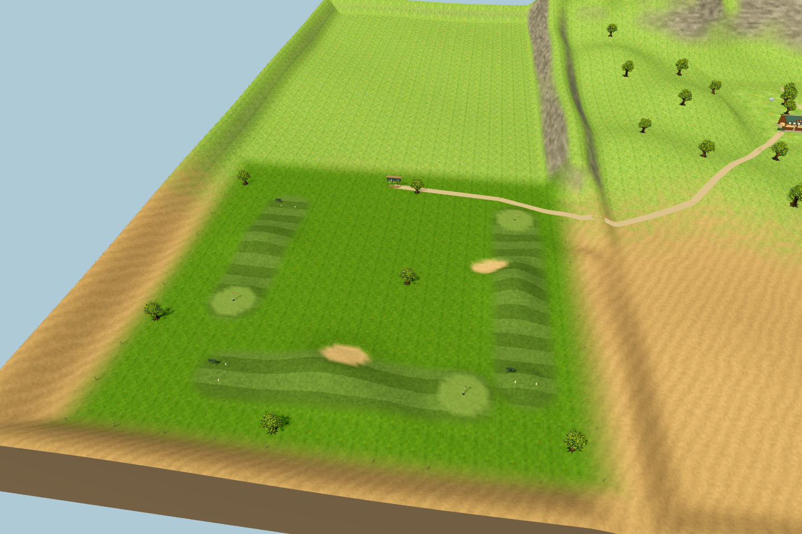
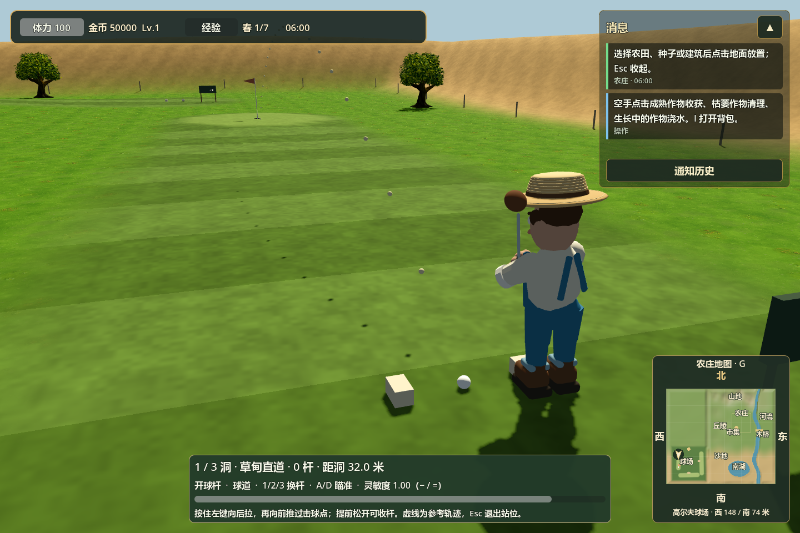

# 湖西高尔夫 · 鼠标挥杆

正式入口为 `scenes/farm3d/main.tscn`。球场位于市集西南、南湖西侧，三条球道全部放在新增土地上。地图西边界从西 80 米扩至西 176 米，总尺寸 256×224 米；旧农庄、湖泊、岸边钓位及存档地块坐标保持不变，原西侧边坡留出步行连接通道。



## 操作

1. 市集旁有“湖西高尔夫”路牌，沿小路走到球杆架（西 124 / 南 62 米）。靠近后点击告示牌或按 **E** 免费开始。
2. 走到 1 号发球台的球旁，按 **E** 进入击球站位。默认镜头中角色站在球右侧，右手主握、左手辅助，从右侧抬杆并向左挥出。
3. **A/D** 微调瞄准，**Q/E** 调整人与球的站距（0.68–0.98 米）；**W/S 或滚轮** 上下调整触球点，操作条上的球形图示显示当前触球位置。击球下部配合大力度可挑起球，中心轻击则沿地面滚动。**1/2/3** 切换开球杆、挖起杆、推杆，并设置对应的默认触球点。果岭推荐推杆，沙坑推荐挖起杆。
4. **按住鼠标左键，向后拉，再向前推过击球点**。后拉幅度决定蓄势，前推速度影响力度，左右偏移改变出球方向。球在角色下杆触球时发出。
5. 球停稳后，使用 WASD、Shift 走到球旁继续。小地图标记球与旗杆，操作条显示距球、距洞距离。
6. 进洞后步行到下一洞发球台，按 E 开始下一洞。三洞完成显示总杆数及个人最佳。

提前松开左键会收杆，不计杆数。**Esc** 退出站位或跟球；已经击出的球继续运动。**− / =** 调整本次游戏的挥杆灵敏度，范围 0.4–2.0。**G** 继续控制小地图显隐。打开背包等面板会释放击球控制，不会卡住人物或鼠标。

开始过高尔夫后，在球场内按 **R** 可重开本轮：人物和球回到第 1 洞并进入准备击球状态，本轮杆数清零，个人最佳保留。挥杆、飞行、落杯中及三洞完成后均可重开；离开球场后 R 仍使用原来的角色复位功能，打开面板时不会触发高尔夫重开。

准备、挥杆与跟球时均可**按住右键拖动**转镜头，松开后保留视角。转镜头不改变瞄准；准备阶段右键会取消尚未击出的鼠标蓄势，重新按左键即可挥杆。蓄势时固定方向、站距和触球点，换杆可以取消蓄势。推杆和中心触球使用较短的摆杆动作，下部触球可使用完整挥杆动作。



[站位](images/golf_3d_address.png) · [自由镜头](images/golf_3d_orbit.png) · [推杆准备](images/golf_3d_putting.png) · [向左送杆](images/golf_3d_followthrough.png) · [跟球](images/golf_3d_flight.png) · [球杆架](images/golf_3d_entrance.png) · [真实洞杯](images/golf_3d_cup.png)

## 场地与规则

| 球洞 | 距离 | 特征 |
| --- | --- | --- |
| 草甸直道 | 32 米 | 平缓入门球道，只有轻微起伏，可沿地面攻果岭 |
| 沙丘弯道 | 40 米 | 连续侧坡与沙地，需要补偿球向低处的偏转 |
| 湖风长道 | 46 米 | 较高的长丘与侧坡，低处球路和越丘击球各有难度 |

第 1、2 洞取消独立抬高的果岭平台，球道直接过渡到果岭。第 1 洞沿球道的高差低于 0.4 米；第 2 洞用约 5% 的连续侧坡增加难度。洞口周围仅做很小范围的平整过渡。第 3 洞保留原来的长丘、侧坡、沙坑和果岭起伏。

[平缓草甸](images/golf_3d_meadow_hills.png) · [侧坡球道](images/golf_3d_dune_hills.png) · [长丘与侧坡](images/golf_3d_side_slope.png)

每洞标准杆 3，共 9 杆；没有强制结束本洞的杆数上限，只有实际进洞才完成本洞。草地、果岭和沙坑使用与球物理一致的区域定义。球按重力飞行、落地反弹；滚动时根据实际地形三角面的坡度计算重力分量，上坡减速，下坡加速，横坡会向低处偏转。球在陡坡上减速到转折点后可以回滚。滚动阻力依次为果岭、球道、长草、沙坑递增，坡度和材质共同影响停止距离。

贴地球经过可见洞口、速度不超过 4.5 米／秒时即可落洞。判定检查整个移动线段，覆盖洞口中心和内沿，避免一帧跨过洞口却漏判。飞快滚过、空中越洞或从洞口外侧擦过均不会被吸入。洞口同时切开地形网格与碰撞，杯壁和杯底采用立体几何。

球进入洞口后，先显示 0.4 秒的落杯过程，再结算并显示“进洞”。落杯期间不提前完成本洞，同一杆只结算一次。完成后仍需走到下一发球台按 E。[落洞实景](images/golf_3d_cup_drop.png)

越过场地外侧缓冲边界或进入水面，按本场规则额外罚 1 杆，将球放回本杆起点。当前球道均位于干燥陆地。参考轨迹帮助估计方向和距离，实际球速与落点仍由挥杆和地形决定。

球杆架、三个不同杆头、旗杆、洞杯、发球标记、球和挥杆动作均为原生 3D。树木复用农庄现有橡树。连接小路沿共享地形铺设，生成时跳过已有农田、作物及建筑地块。

## 进度与兼容

沿用项目目录主存档 `data/farm_3d_save.json`，升级为 v4，继续读取 v1/v2/v3。保存本洞、已完成各洞杆数、稳定球位和最佳成绩。

每杆结算后保存；飞行中的自动保存使用上一杆已停稳的检查点，重新加载从该杆起点恢复，避免中途球速或计分重复。离开球场可以继续农事操作，回来后接着打。灵敏度为本次游戏设置，不写入存档。

## 验证

- 地形与球物理：195 项检查，包含前两洞平缓进攻路线、连续侧坡、第 3 洞高度不变，以及原有进洞、重力、摩擦和落杯检查。
- 高尔夫集成：123 项检查，新增 R 在挥杆、飞行、落杯和读档后重开；验证清空本轮、保留最佳、取消旧球结算、恢复存档，以及球场外与面板内不误触。保留超过 12 杆继续本洞、进洞结算、鼠标和镜头检查。
- 本次地形回归 64 项，共 382 项检查通过，高尔夫在实际 OpenGL 窗口复跑不重复计数。实景截图已更新。

```powershell
godot_console.exe --headless --path . --script tests/run_3d_golf_terrain_tests.gd -- --farm-test
godot_console.exe --headless --path . --script tests/run_3d_golf_tests.gd -- --farm-test
godot_console.exe --path . --script tests/run_3d_golf_tests.gd -- --farm-test
godot_console.exe --path . --script tests/capture_3d_golf.gd -- --farm-test
godot_console.exe --path . --script tests/capture_3d_golf.gd -- --farm-test --cup-drop-only
```

测试均使用独立临时存档并在结束后清理，不读取或覆盖玩家正式存档。
