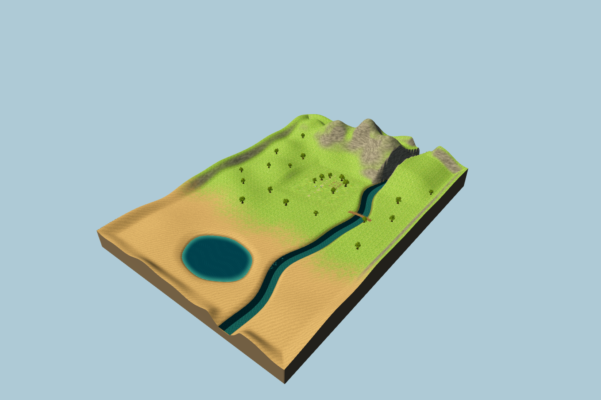
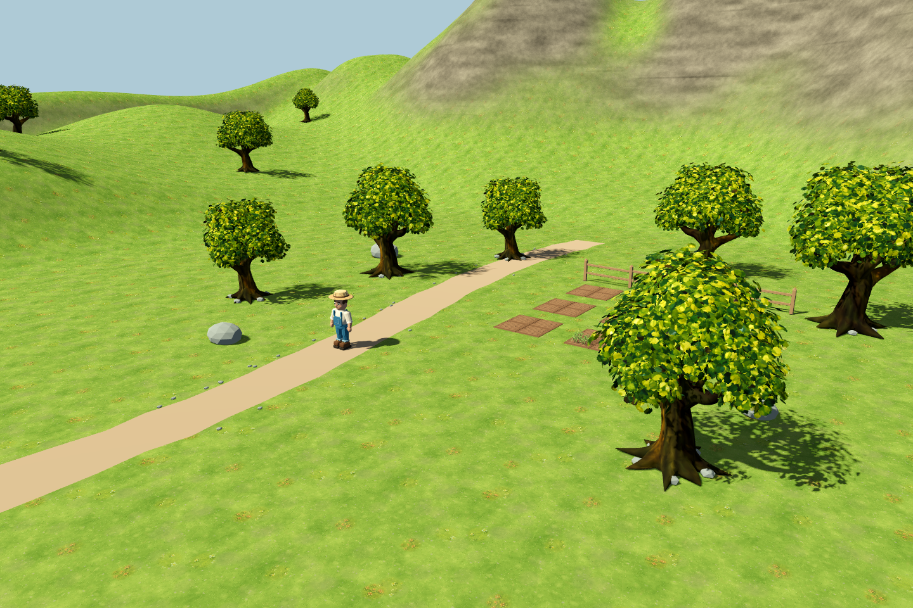
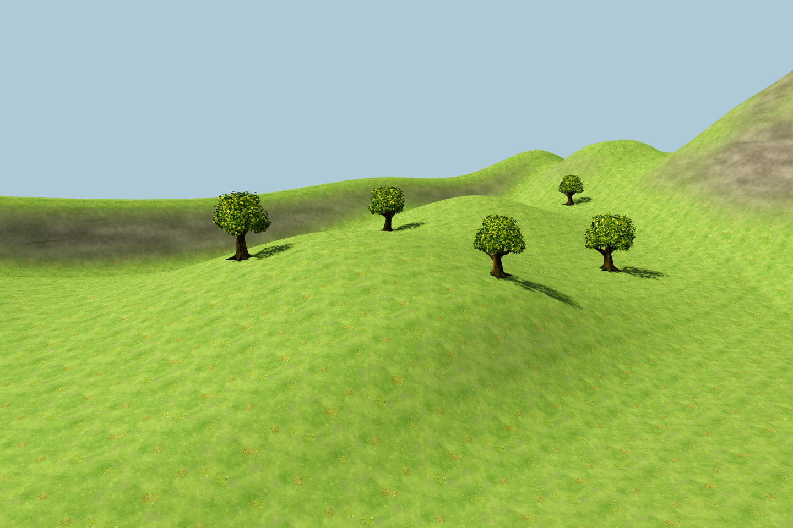
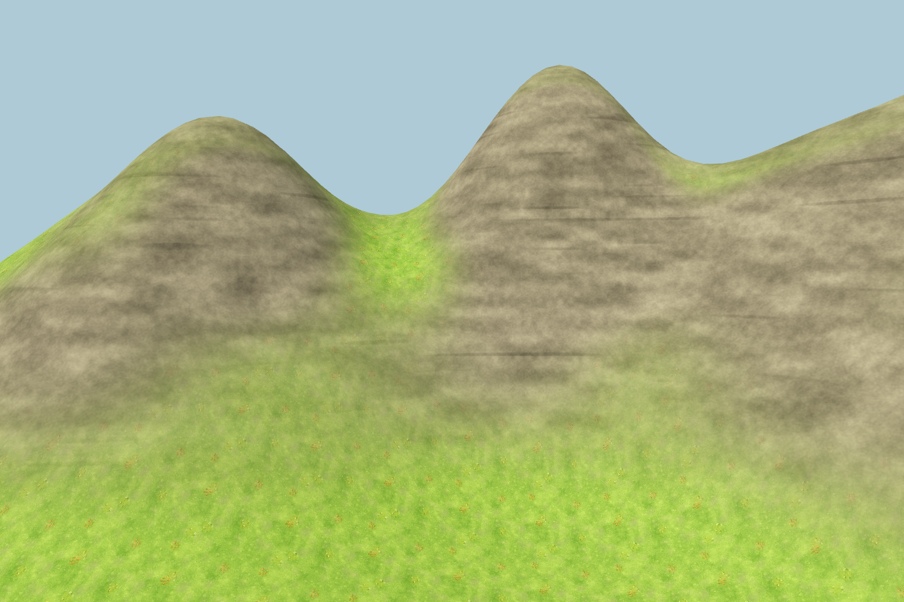
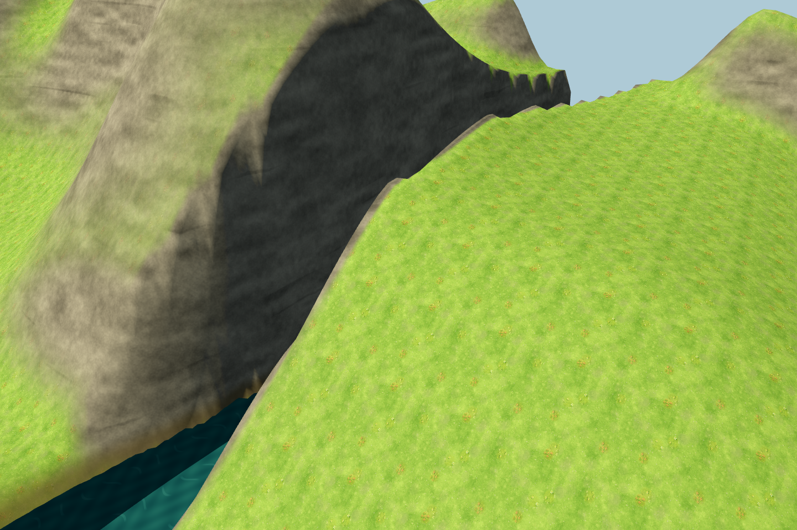
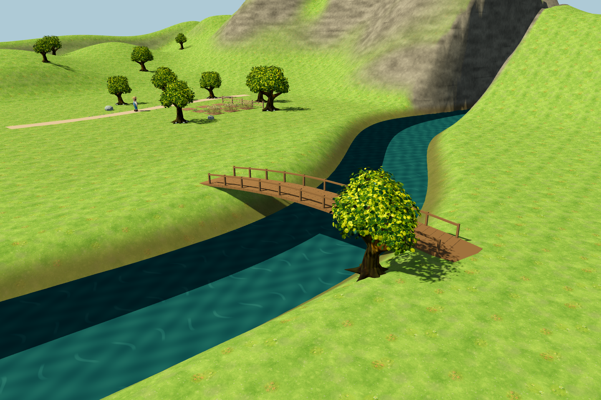
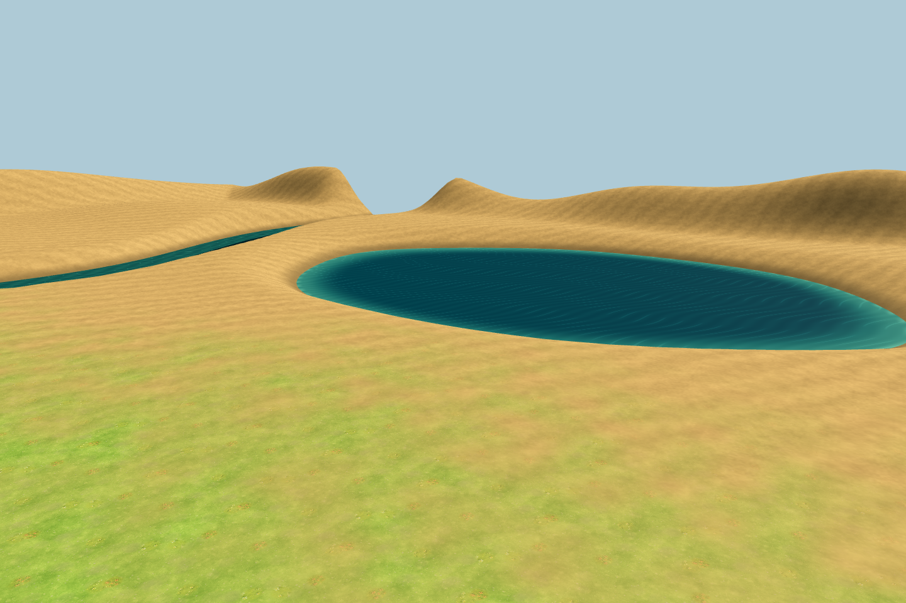
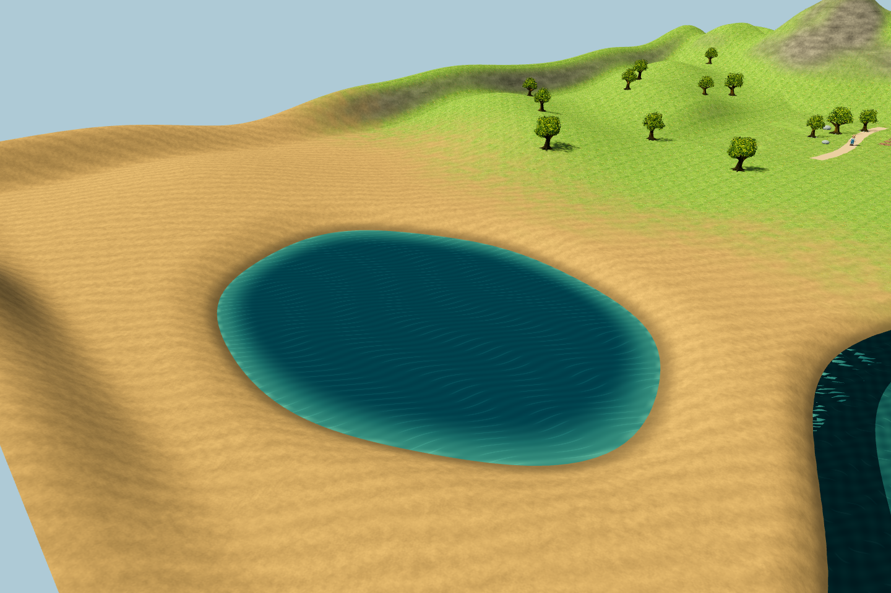
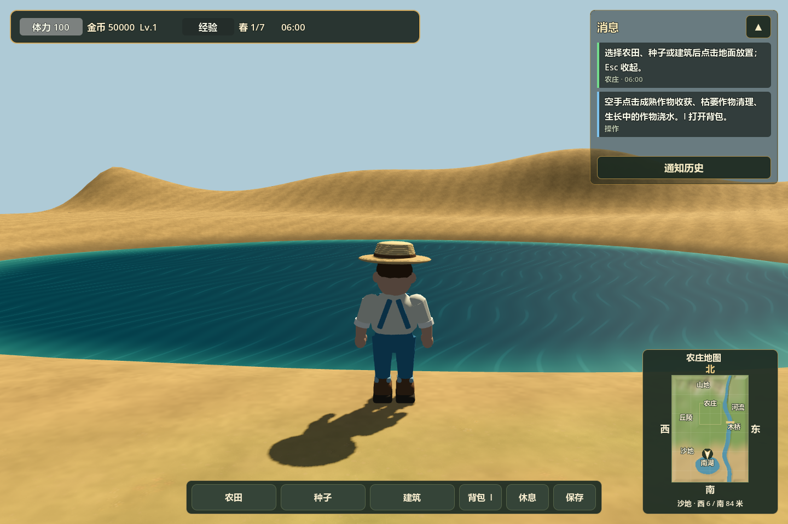

# 扩展 3D 地图

正式入口仍为 `scenes/farm3d/main.tscn`。可探索地形现为 **160 × 224 米**，南界由 `Z=80` 延伸到 `Z=144`，东西范围 `X=-80…80`、北界 `Z=-80`。采用原有手绘草地贴图、橡树和暖色环境光，南面增加程序化沙地材质、低沙丘和湖泊。



## 区域与行走

| 区域 | 位置与特点 |
| --- | --- |
| 平原 | 中央原农庄，保持原来的地面高度、农田、道路、树木和围栏坐标 |
| 丘陵 | 西侧及西南侧，圆润缓坡与低谷，散布原风格的橡树 |
| 山地 | 北侧多座不等高山峰，最高约 30 米，草坡过渡到灰暖色岩面 |
| 峡谷 | 东北侧高台被河道切开，河床与岩壁存在真实高差 |
| 河流 | 东侧南北贯通，带流动水纹，南段有带护栏和坡道的木桥 |
| 沙地 | 从 `Z≈50…86` 的草沙混合带过渡到南侧沙地，低沙丘与湿沙湖岸相接 |
| 南湖 | 中心约 `(-6,108)`，湖盆约 52 × 38 米，水面随实际岸线裁切，浅水与深水分色 |

北方对应世界坐标 `-Z`，西方对应 `-X`。按 **Tab** 切换全景与第三人称，**R** 返回原农庄。桥位于东侧河流的南段，世界坐标约 `(42, 18)`。桥面可直接步行通过；浅水河床可涉水，行走速度降至平地的 60%。陡壁不能直接攀爬，可沿河床返回南段缓岸。










## 湖岸钓鱼

从农庄沿小地图向南走即可穿过草沙混合带到达南湖北岸。湖水高度为 `Y=-1.15`，中央湖底约 `Y=-3.8`；水面使用缓慢的碎波纹，岸边是能步行站立的缓坡。河流与湖泊均已接入[完整钓鱼流程](fishing-3d.md)，湖内沿用现有涉水减速。

保留三处岸边站位；每处半径 2.4 米内禁止新放农田和建筑，保持钓位可达：

| 钓位 | 站位 `(X,Z)` | 水中落点 `(X,Z)` |
| --- | --- | --- |
| 北岸 | `(-6,84)` | `(-6,92)` |
| 西岸 | `(-40,108)` | `(-29,108)` |
| 南岸 | `(-6,132)` | `(-6,124)` |

场景节点位于 `Landscape/LakeFishingShores`，三个 `Marker3D` 加入 `farm3d_fishing_shores` 组，提供 `water_body_id=south_lake` 元数据和参考 `CastTarget` 子节点。定义统一维护在 `terrain_profile.gd` 的 `LAKE_FISHING_SPOTS`。实际钓鱼系统按玩家位置实时查找水面落点，河湖其他满足坡度、水深与无遮挡条件的岸边也可钓鱼。



## 玩法接入与存档

- 新区域的平缓地块可以开垦、种植和放置建筑；地块高度与地形实际三角面一致，土块及碰撞随缓坡倾斜，作物保持直立。
- 河道、陡坡、树干周围和桥梁占地不能开垦。建筑占地内的地块中心高差超过 20 厘米时拒绝建造。
- 操作距离计入高度，无法隔着较大高差操作地块。全景选格支持扩展后的相机距离，地图边界不会阻挡鼠标射线。
- 旧农庄的网格原点和地块编号保持不变，原存档继续使用 `user://farm_3d_save.json`。新区域支持负网格坐标，扩展地块无需修改存档版本。

## 维护与验证

`scripts/farm3d/terrain_profile.gd` 定义确定性的高度、世界边界、沙地过渡与湖泊范围；`landscape.gd` 生成 140 个 16 米地形分块和对应碰撞、河湖、桥梁及橡树。地块、小地图、玩家越界判断和边缘碰撞共用世界边界；地图按等比例显示完整长方形区域。`assets/terrain/landscape.gdshader`、`river.gdshader` 和 `lake.gdshader` 负责地面与水面。地形当前在 Godot 中生成，原角色、树木和作物继续使用 Blender 模型。

验证命令（均使用隔离测试模式，不读写玩家存档）：

```powershell
godot_console.exe --headless --path . --script tests/run_3d_landscape_tests.gd -- --farm-test
godot_console.exe --headless --path . --script tests/run_3d_south_lake_tests.gd -- --farm-test
godot_console.exe --headless --path . --script tests/run_3d_minimap_tests.gd -- --farm-test
godot_console.exe --headless --path . --script tests/run_farm3d_scene_tests.gd -- --farm-test
godot_console.exe --headless --path . --script tests/run_3d_farming_tests.gd -- --farm-test
godot_console.exe --headless --path . --script tests/run_3d_target_system_tests.gd -- --farm-test
godot_console.exe --headless --path . --script tests/run_3d_farm_interaction_tests.gd -- --farm-test
godot_console.exe --path . --script tests/capture_3d_landscape.gd -- --farm-test
godot_console.exe --path . --script tests/capture_3d_south_lake.gd -- --farm-test
```

地形专项 64 项检查覆盖五类地形、原地面坐标、分块接缝碰撞、丘陵行走、完整过桥、涉水减速、河道与陡坡放置限制、坡地种植与存档恢复、建筑高差限制和全景射线选格。截图由正式游戏场景直接渲染。

南湖专项 52 项检查覆盖沙地过渡、湖盆与河流判定、南部地形碰撞、步行穿越原边界、三处钓位站立和落点、保留区域放置限制、湖水涉水、新坐标存档恢复和全景选格。小地图 22 项检查覆盖扩展边界、南湖定位、等比例显示、方向／布局，以及 G 键开关和按住防重复切换。
