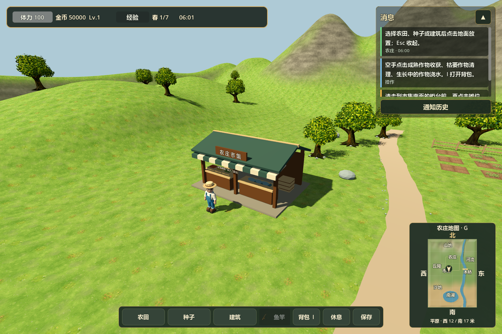
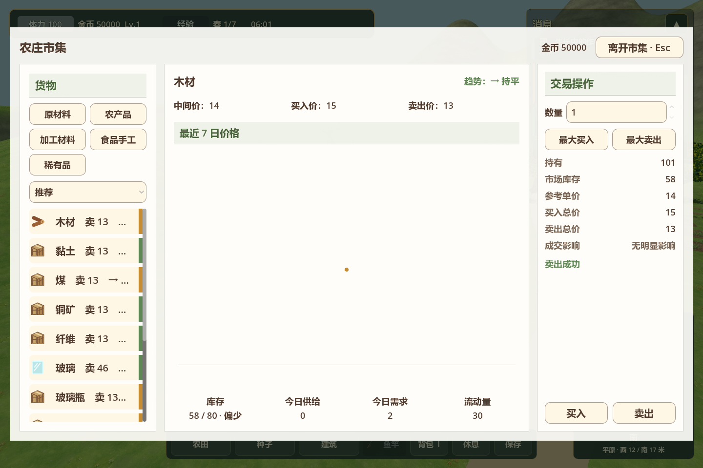
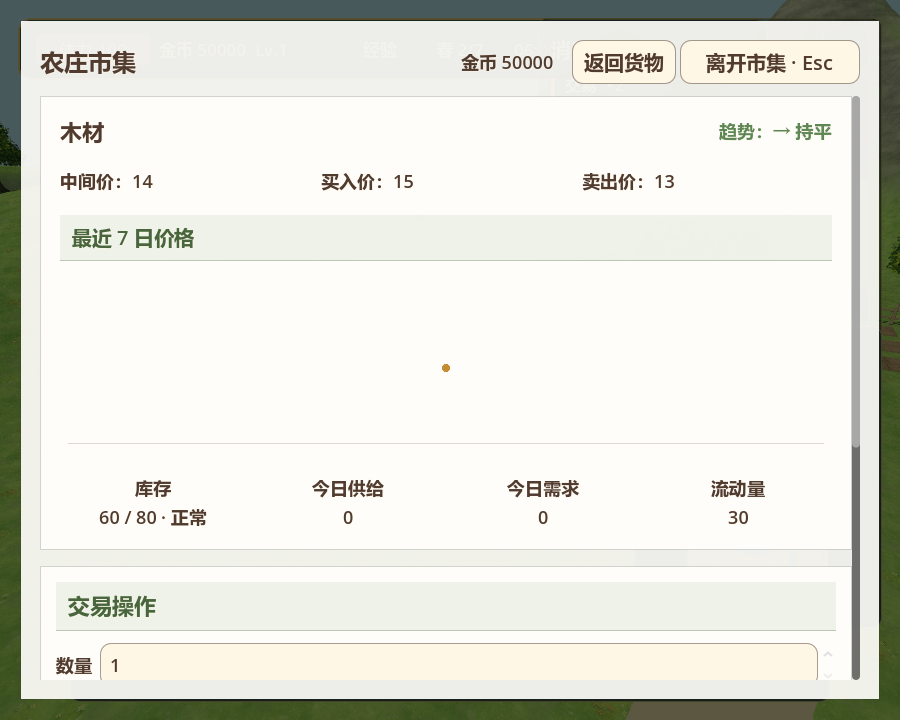

# 3D 市场移植

入口仍为 `scenes/farm3d/main.tscn`。默认市集在西 12 / 南 12 米，小地图有金色标记。沿农庄道路向南，走到市集南面的柜台前，左键点击建筑打开交易窗口。远处和背面点击会提示先到柜台前。

市集采用原生 3D 几何：木柱、后墙、双坡屋顶、条纹雨棚、招牌、货箱、蔬果与鱼货柜台。碰撞阻挡玩家穿过柜台和后墙，占地禁止种植与建造。



## 交易

- 原市场的分类、排序、持有量、库存、7 日行情、买卖数量、最大买入/卖出与大额确认继续使用。
- 买入物品进入当前 3D 背包，出售作物和鱼获增加同一钱包的金币；建造继续使用这个钱包。
- 打开市集会收起鱼竿、清除放置预览并暂停角色操作。Esc 优先关闭大额确认或窄屏详情，再关闭市场；I 可转到背包。
- 交易后自动保存。价格和库存改变时，原交易面板会重新计算报价、失效过期确认。



## 共用经济逻辑与存档

`Farm3DSession` 直接组装 `MarketSystem`、`NpcEconomySystem`、`EconomySystem`，沿用 `GameData` 的商品、NPC 与居民需求目录。3D 当前物品容器为背包，经济系统使用其原有背包交易路径，保留报价、容量、金币和库存检查及事务回滚。

每天在农田与生产结算后，调用原 NPC 生产/采购/出售/居民需求，再执行原市场定价与价格历史更新。日游标防止重复结算；休息跨日与自然跨日使用同一事件链。

v3 存档增加 `market`、`npc_economy`、`market_site`，先校验行情、NPC 状态、日期一致性和占地，再恢复游戏状态。v1/v2 存档在原日期初始化市场，默认位置已有农田或建筑时另选空地；位置随存档保存。

## 验证

使用 Godot 4.7.1；`--farm-test` 禁用玩家存档自动读取/写入，市场测试使用独立临时存档。

| 测试 | 结果 |
| --- | --- |
| `run_3d_market_tests.gd` | 103 项通过：实体点击、距离与背面限制、买卖及失败原子性、鱼货出售、窗口、日结、v2 迁移与 v3 恢复 |
| `run_task2_trade_tests.gd` | 1,403 项通过：共用市场、报价、交易、库存路由及 NPC 经济 |
| `run_3d_target_system_tests.gd` | 107 项通过 |
| `run_3d_fishing_tests.gd` | 105 项通过 |
| `run_3d_farm_interaction_tests.gd` | 44 项通过 |
| `run_farm3d_scene_tests.gd` | 52 项通过 |
| `run_3d_farming_tests.gd` | 45 项通过 |
| `run_3d_minimap_tests.gd` | 22 项通过 |

完整 `run_economy_system_tests.gd` 共 71,040 项检查，其中 13 项失败。以本次改动前的 HEAD 源码副本复跑，失败名称与数量完全一致：水车覆盖/维护存档、蜂箱产出，以及长期模拟的作物与鱼类配方断言。该副本位于临时目录，未切换或修改当前分支。上述市场专项、共用交易与 3D 回归均通过。

实景截图来自 GPU 渲染的同一市场测试：

```powershell
godot_console.exe --path . --script tests/run_3d_market_tests.gd -- --farm-test --capture-market
```

900×720 窗口使用原详情抽屉，交易区可向下滚动：


