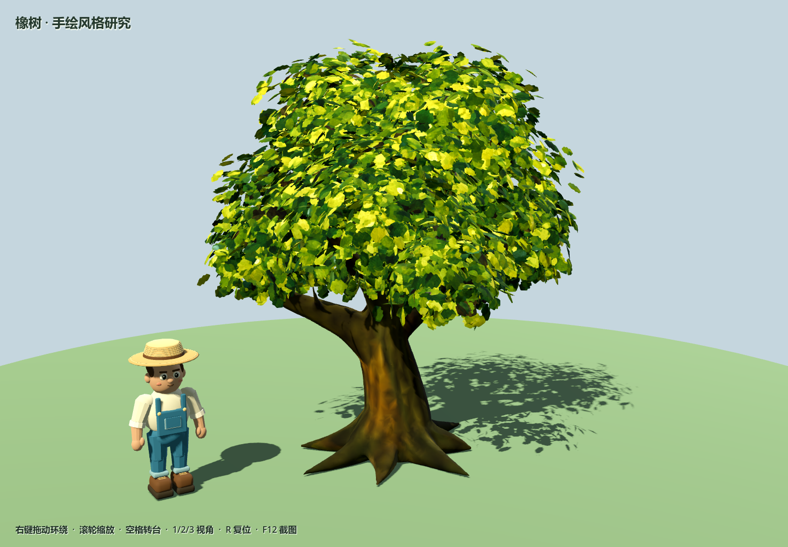
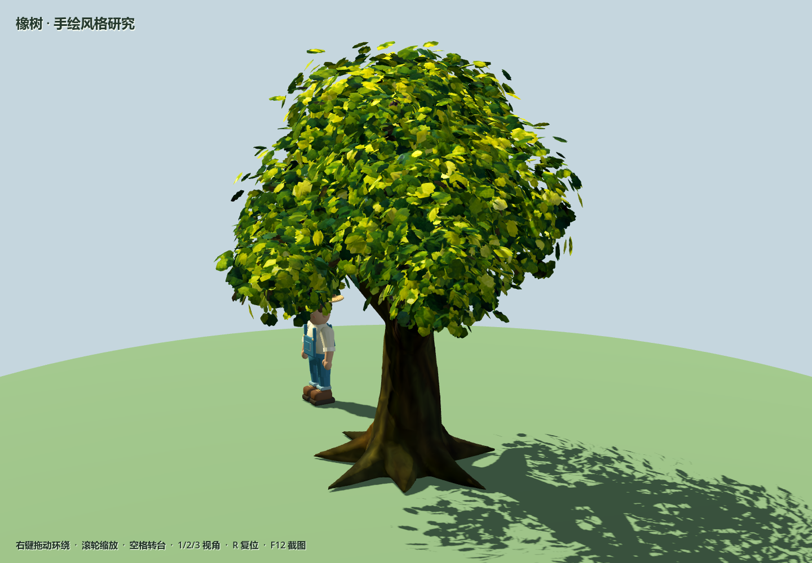
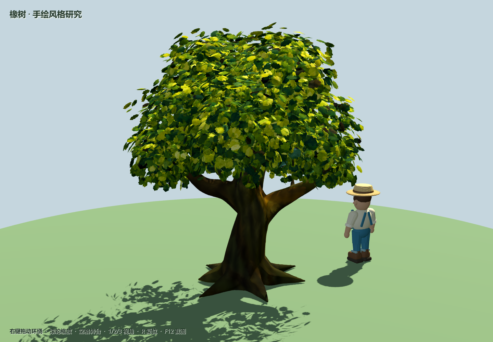
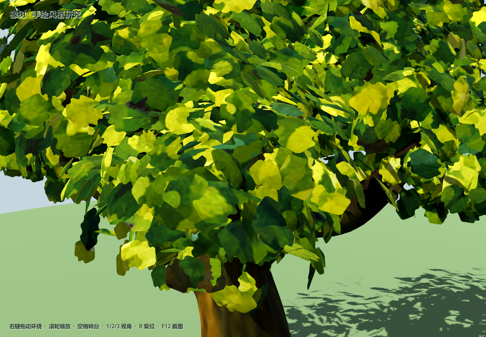

# 手绘橡树验证记录

日期：2026-09-06。分支：`feature/3d-farm-preview`。

本轮只制作一棵完整橡树供造型与材质评审。参考原 `assets/vegetation/tree-oak-large.png`；根干枝使用连续平滑网格，叶冠使用独立弯曲叶片与原图的手绘笔触。独立树场景可复用，旧农庄原型未批量换树。

## 验证结果

- Blender 5.2.1 后台生成和源文件重开成功。源文件保留模型与摄影棚集合，原手绘图片已打包。
- GLB 自包含：14,219,596 字节，两个网格、两个材质、一张内嵌 PNG，不引用外部图片路径。树皮与叶片均保留 `COLOR_0`，叶片保留 UV。
- 实际导入曾出现树干变白：网格里的颜色存在且有差异，但材质没有启用顶点色。专用 `EditorScenePostImport` 已修复；重新导入后两种材质均启用线性顶点色作为反照率。
- `godot_console.exe --headless --path . --script tests/run_painted_oak_tests.gd`：14 项通过，包括真实网格、手绘图片、顶点色数据及材质启用、根干高度、碰撞层、完整树形入镜和侧视角。
- `godot_console.exe --headless --path . --script tests/run_farm_3d_preview_tests.gd`：原农庄预览 18 项通过。
- Godot 4.7.1 / OpenGL Compatibility / RTX 4080 SUPER 完成正面、侧面、背面和近景实际截图，均返回退出码 0。Blender 渲染与 Godot 灯光不同，交付画面以 Godot 实拍为准。

## 使用

```powershell
./tools/preview_tree.ps1
./tools/preview_tree.ps1 -View front -CapturePreview D:/UnityProject/villa/tmp/oak-front.png
```

右键环绕、滚轮缩放、空格切换自动转台、1/2/3 正侧背面、R 复位、F12 截图。模型源文件是 `art/blender/painted_oak.blend`；游戏树场景是 `scenes/vegetation/painted_oak.tscn`。

## 游戏内截图









造型评审版本保留较高叶片细节；本轮不包含树林批量性能验证、季节变体、风动或砍伐动画。
