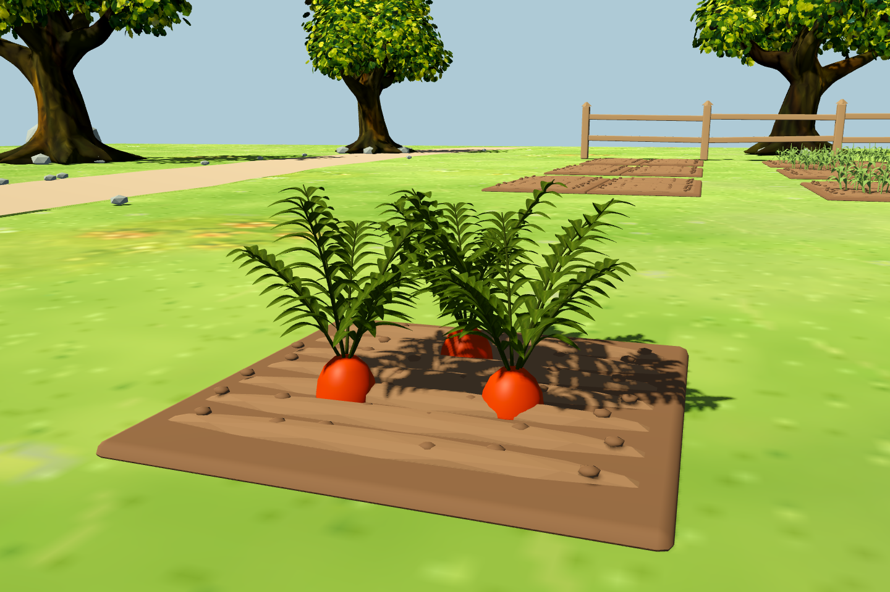
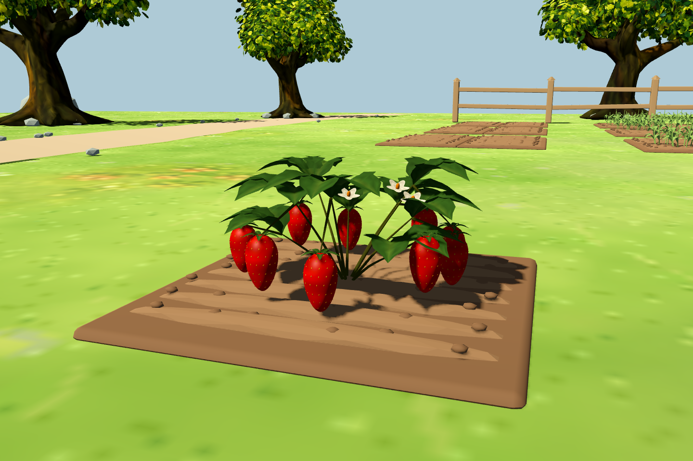
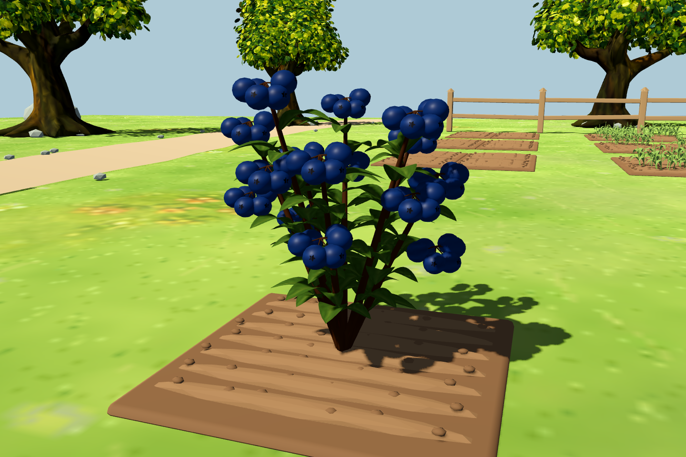
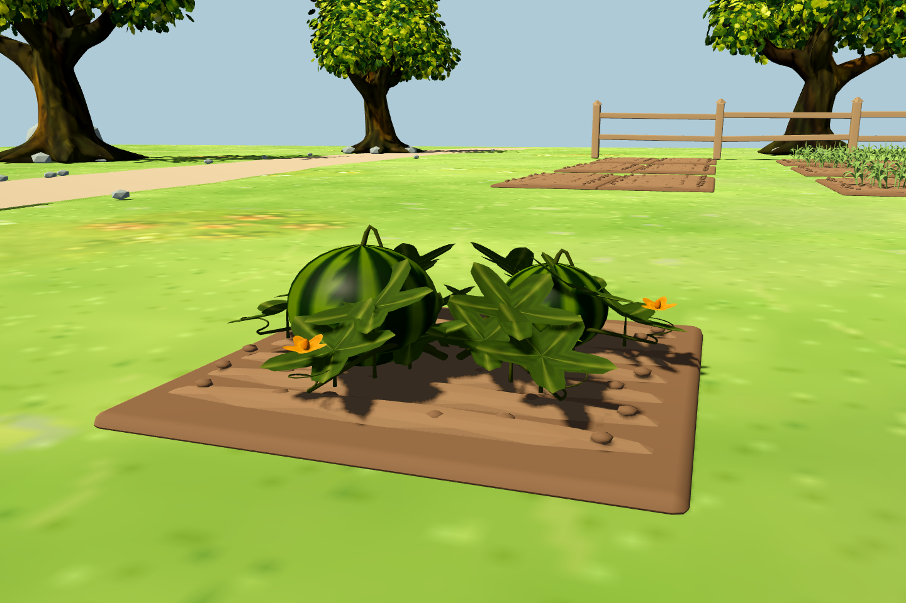
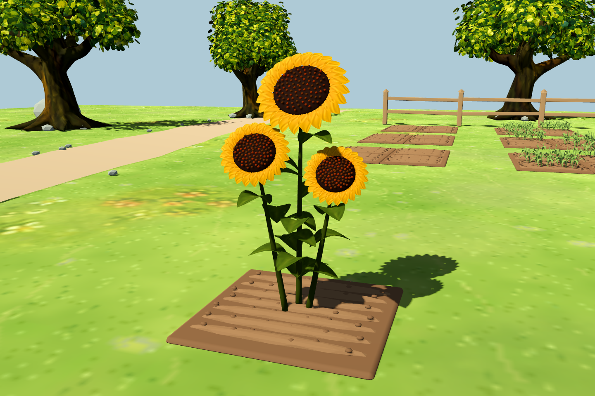
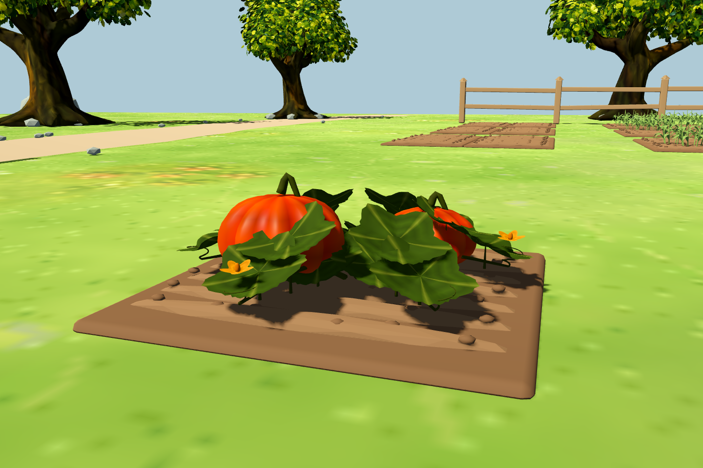
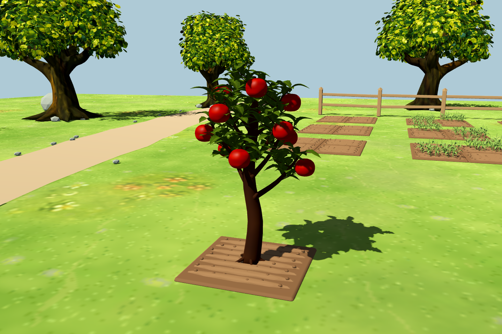
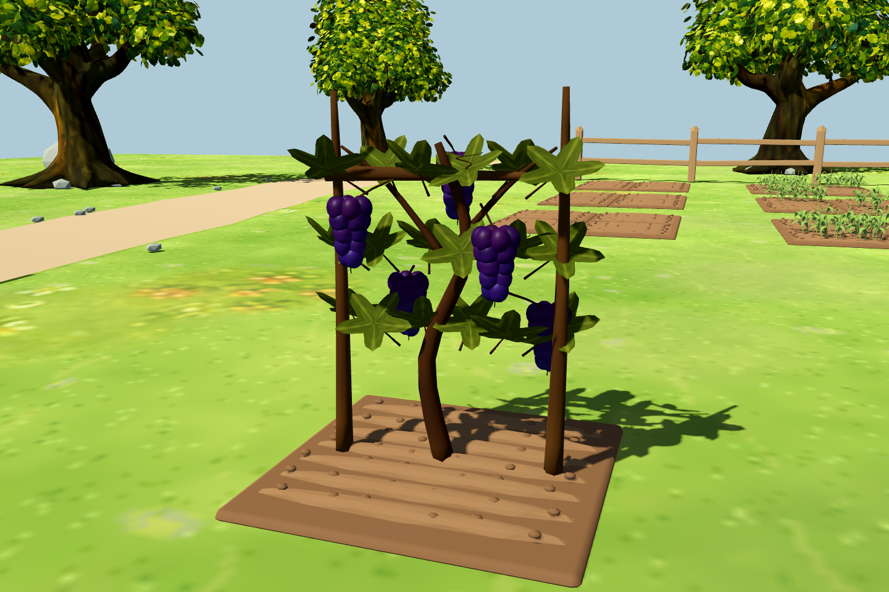
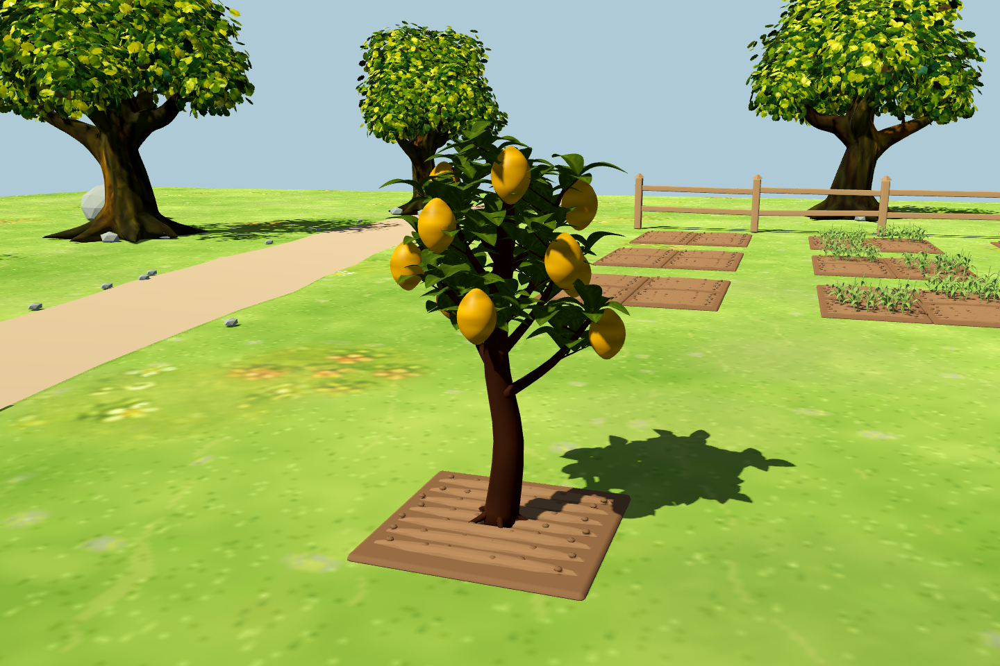

# 全部作物的 3D 模型接入

原目录中剩余的 10 种作物已转换为 Blender 模型：胡萝卜、草莓、蓝莓、西瓜、向日葵、南瓜、苹果、桃子、葡萄、柠檬。每种仅有播种（果树为树苗）和成熟两版；生长中维持第一版，成熟后切换，枯萎时复用对应几何并染褐色。

加上已有谷物、玫瑰、土豆、番茄和薰衣草，现在正式 3D 农庄的 15 种作物都使用立体视觉，已移除旧作物图片回退路径。玫瑰和谷物已有阶段不变。

## 模型与效果

保留原插画的主要形态：胡萝卜有露出土面的橙色根冠和羽状叶；草莓有三出复叶、籽点和白花；蓝莓有果串与果脐；瓜类有曲面裂叶、贴地藤蔓与卷须；向日葵有黄色花瓣和立体花盘；果树区分苹果圆叶红果、桃树细长叶和桃缝、柠檬椭圆黄果；葡萄有木架、攀缘枝叶和紫色果串。

以下截图均来自正式农庄中的同一真实地块。相机分别拍摄模型正面与低角度背面，模型本身的地块朝向固定。

| 作物 | 成熟模型 | 其他角度 |
| --- | --- | --- |
| 胡萝卜 |  | [播种](images/carrot_3d_seed.png) · [背面](images/carrot_3d_back_low.png) |
| 草莓 |  | [播种](images/strawberry_3d_seed.png) · [背面](images/strawberry_3d_back_low.png) |
| 蓝莓 |  | [播种](images/blueberry_3d_seed.png) · [背面](images/blueberry_3d_back_low.png) |
| 西瓜 |  | [播种](images/watermelon_3d_seed.png) · [背面](images/watermelon_3d_back_low.png) |
| 向日葵 |  | [播种](images/sunflower_3d_seed.png) · [背面](images/sunflower_3d_back_low.png) |
| 南瓜 |  | [播种](images/pumpkin_3d_seed.png) · [背面](images/pumpkin_3d_back_low.png) |
| 苹果 |  | [树苗](images/apple_3d_seed.png) · [背面](images/apple_3d_back_low.png) |
| 桃子 |  | [树苗](images/peach_3d_seed.png) · [背面](images/peach_3d_back_low.png) |
| 葡萄 |  | [播种](images/grape_3d_seed.png) · [背面](images/grape_3d_back_low.png) |
| 柠檬 |  | [树苗](images/lemon_3d_seed.png) · [背面](images/lemon_3d_back_low.png) |

## 接入与验证

模型根部原点统一在地块土面，根、种子及树苗底部略埋入土中；花叶和果实都是网格，不启用 billboard。原种子／树苗 ID、生长时间、季节、温室要求、收获数量、背包与存档保持不变。存档中的原有作物加载后自动使用新模型，不迁移数据。旧 2D 游戏仍保留原图片场景。

- `run_3d_two_stage_crop_tests.gd`：扩展到全部 13 种两阶段作物，518 项通过，覆盖模型注册、颜色、体积、落地、阶段切换、存档恢复、收获清理和旧场景保留。
- `run_3d_target_system_tests.gd`：107 项通过，包含全部 15 种作物和真实温室建筑的规则回归。
- `run_3d_rose_tests.gd`：80 项通过，玫瑰五阶段回归。
- `capture_3d_remaining_crops.gd`：实机生成 30 张截图，使用 `--farm-test` 隔离玩家存档。柠檬截图与模型测试使用显式温室覆盖；真实温室建造规则由目标系统测试验证。

```powershell
godot_console.exe --headless --path . --script tests/run_3d_two_stage_crop_tests.gd -- --farm-test
godot_console.exe --path . --resolution 1440x960 --script tests/capture_3d_remaining_crops.gd -- --farm-test
```

各作物独立 `.blend` 文件位于 `art/blender/`，导出模型位于 `assets/models/crops/<crop_id>/`。详见[资产目录与重建说明](../../assets/models/crops/README.md)。
