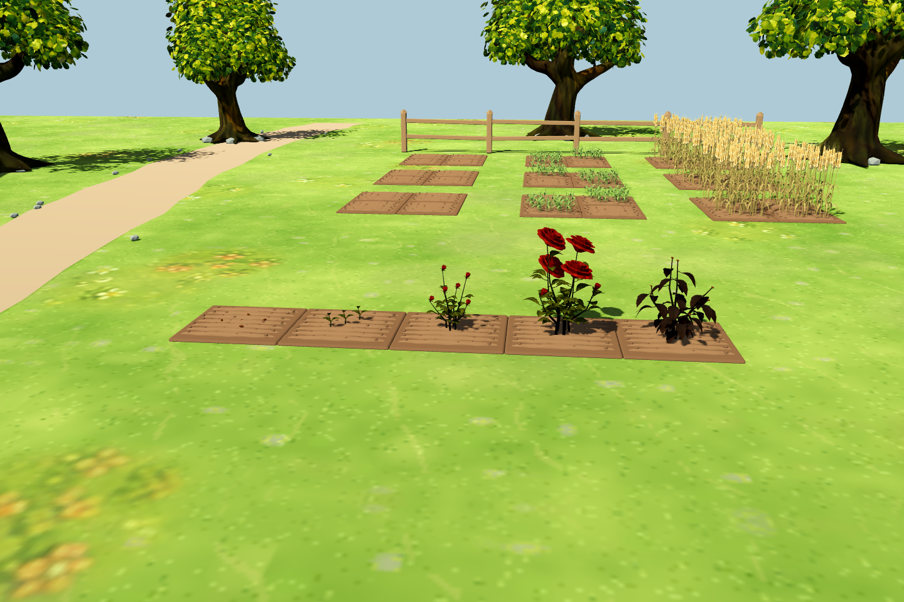
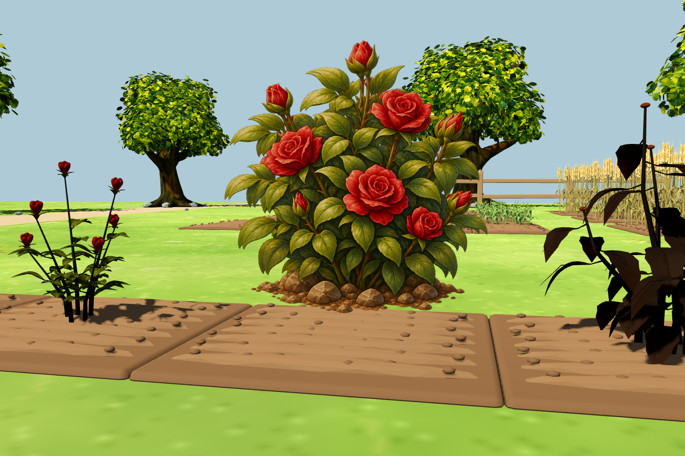
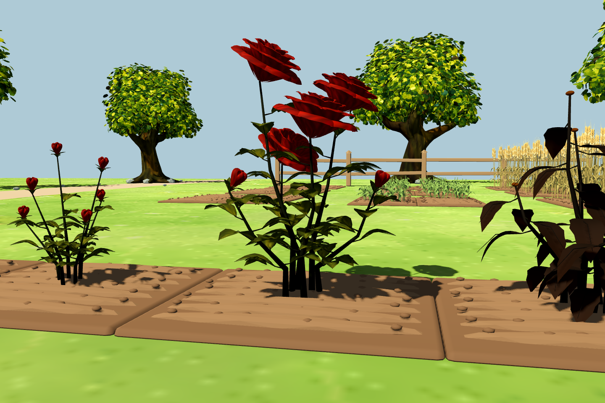
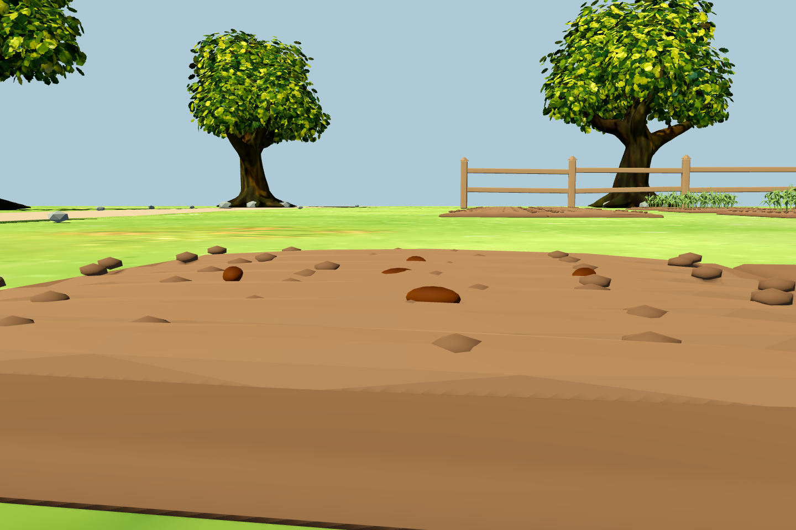

# 玫瑰：从 2.5D 图片改为 3D 作物

## 原因

原作物场景的 `CropSpriteCluster` 使用前后两层 `Sprite3D`，并开启 `BILLBOARD_ENABLED`。这适合固定俯视镜头，第三人称镜头旋转时整张图片会跟着转动，无法呈现植株真实的侧面和背面。

图片位置按整张画布的半高计算，但图片底部有透明留白。3D 地块另外给作物加了 0.06 米偏移，土面名义高度约 0.045 米。以玫瑰图片 alpha > 32 的可见边界估算，平视时种子两层可见图像约高出土面 0.095 / 0.158 米，成熟图约高出 0.067 米；实际随镜头俯仰还会变化。将图片下移只能缓解悬浮，不能补出立体侧面。

## 本次方案

先将玫瑰替换为独立 Blender 模型，根部原点固定在土面，种子半埋入土。茎、复叶、叶脉、花苞与卷曲花瓣均为真实网格；沿用原插画的深红、橄榄绿配色并调整其自带阴影，让颜色适应游戏光照。

正式游戏的玫瑰按原生长进度使用播种、幼苗、花苞、成熟四个模型，枯萎时切换褐色下垂枝叶。早期枯萎保留对应幼小体型并变褐色。种植、浇水、成熟、收获、清理、背包和存档规则继续复用原系统。

此次只转换玫瑰；除已有 3D 谷物外，其他作物仍使用旧图片。后续可按相同的根部原点、固定朝向和生长阶段约定逐种替换。模型源文件、生成与导入说明见[资产说明](../../assets/models/crops/rose/README.md)。

## 实机截图

截图使用正式 `scenes/farm3d/main.tscn` 和真实地块，在独立测试会话中摆放五阶段玫瑰，没有读写玩家存档。

从左至右：播种、幼苗、花苞、成熟、枯萎。



| 原图平视 | 新模型平视 |
| --- | --- |
|  |  |



[侧面](images/rose_3d_side.png) · [背面](images/rose_3d_back.png)

## 验证

- `run_3d_rose_tests.gd`：80 项，验证各阶段立体尺寸、根部穿过土面原点、无 Sprite3D / billboard、导入颜色、生长朝向不变、镜头环绕、收获与枯萎清理，以及旧 2D 场景保留。
- `run_3d_target_system_tests.gd`：107 项通过，全部原种子与收获、水田、建筑、存档回归。
- `run_3d_farming_tests.gd`：45 项通过，生长、库存事务和存档回归。

```powershell
godot_console.exe --headless --path . --script tests/run_3d_rose_tests.gd -- --farm-test
godot_console.exe --path . --resolution 1440x960 --script tests/capture_3d_rose.gd -- --farm-test
```
