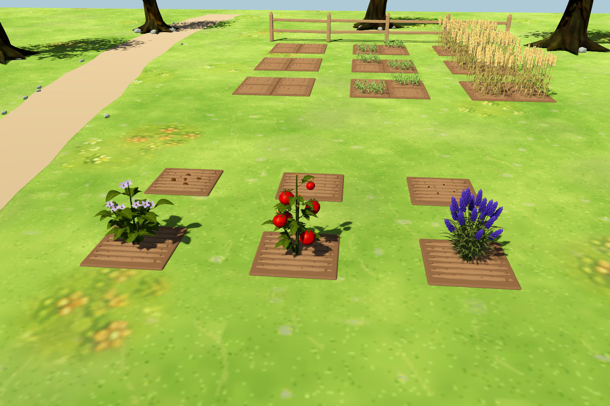
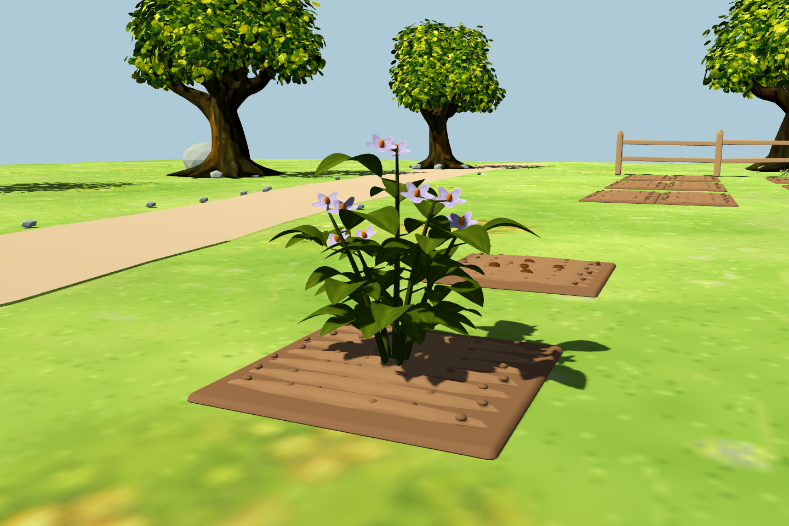
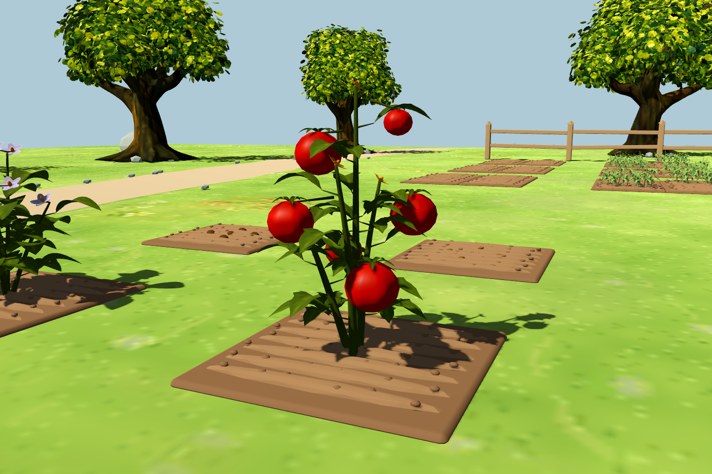
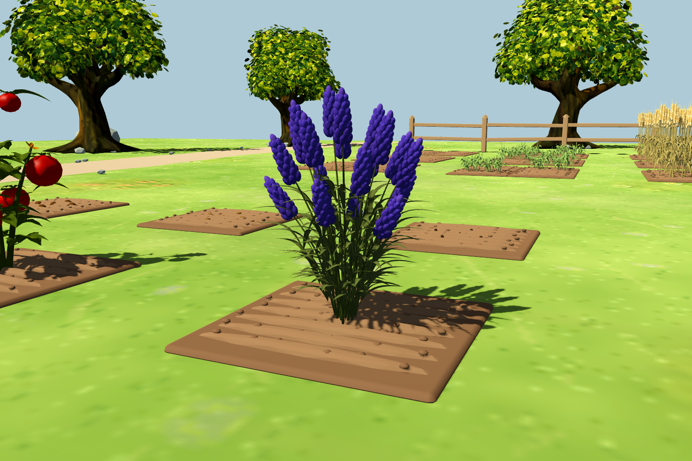

# 土豆、番茄与薰衣草：两阶段 3D 模型

三种作物已接入正式农庄，每种仅使用播种和成熟两个模型。成熟前显示半埋入土的种子（或种薯），达到原生长时间后切换成熟植株。枯萎时复用对应模型并变为褐色。

- 土豆：带芽眼的种薯、宽叶矮株、淡紫白花与黄色花心。
- 番茄：扭曲分枝、锯齿叶、红色果实、星形萼片和黄色小花。
- 薰衣草：丛生细茎、灰绿长叶、环绕花轴排列的紫色花穗。

叶片、花朵和果实都是真实网格，根部原点在土面，切换视角不会让整株转向镜头。原季节限制、生长时间、收获数量、背包与存档保持不变。番茄配置中虽然有续收字段，当前共用收获实现会移除整株；此次沿用这一现有规则。

## 实机效果

前排从左至右：成熟土豆、番茄、薰衣草；后排为各自播种模型。



| 土豆 | 番茄 | 薰衣草 |
| --- | --- | --- |
|  |  |  |
| [种薯近景](images/potato_3d_seed.png) | [种子近景](images/tomato_3d_seed.png) | [种子近景](images/lavender_3d_seed.png) |
| [低角度背面](images/potato_3d_back_low.png) | [低角度背面](images/tomato_3d_back_low.png) | [低角度背面](images/lavender_3d_back_low.png) |

截图使用正式农庄场景和种植系统，通过 `--farm-test` 隔离玩家存档。

## 验证

- `run_3d_two_stage_crop_tests.gd`：114 项通过，包含导入颜色、无 billboard、三轴体积、根部落地、成熟前保持播种模型、成熟切换、存档恢复、收获入包、枯萎清理与旧 2D 场景保留。
- `run_3d_rose_tests.gd`：80 项通过，共享导入脚本更名后的玫瑰回归。
- `run_3d_target_system_tests.gd`：107 项通过，原种子、水田、建筑、收获与存档回归。

```powershell
godot_console.exe --headless --path . --script tests/run_3d_two_stage_crop_tests.gd -- --farm-test
godot_console.exe --path . --resolution 1440x960 --script tests/capture_3d_two_stage_crops.gd -- --farm-test
```

[模型、源文件与重建说明](../../assets/models/crops/README.md)
