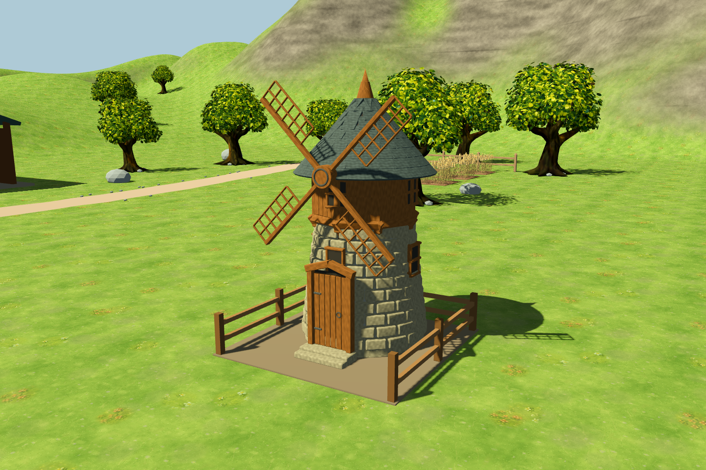
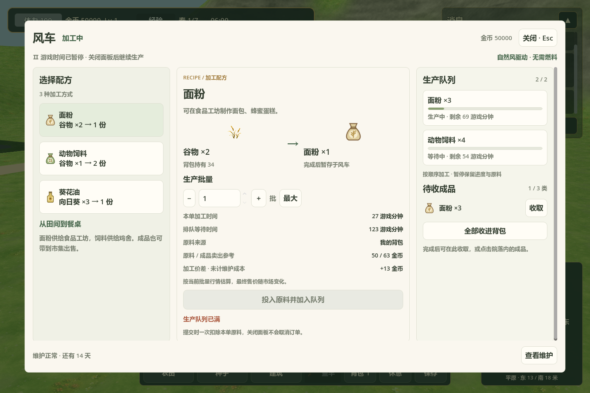

# 3D 风车与生产操作

正式入口：`scenes/farm3d/main.tscn`。在建筑菜单放置风车，保留原来的 3×3 院落占地与木板 12、石砖 8、绳索 2 建造成本。

## 操作

1. 完工后走到南面的院门前，左键点击风车。
2. 选择面粉、动物饲料或葵花油，设置生产批量。
3. 点击“投入原料并加入队列”，从背包一次扣除本单原料。最多两笔订单顺序加工。
4. Esc 关闭面板，游戏时间恢复、叶片转动；再次打开可检查进度。
5. 完成后点击院门处的成品，或在面板逐类／全部收进背包。背包不足时保持成品不变。

| 每批投入 | 每批产出 | 时间 |
| --- | --- | --- |
| 谷物 ×2 | 面粉 ×1 | 27 游戏分钟 |
| 谷物 ×1 | 动物饲料 ×2 | 27 游戏分钟 |
| 向日葵 ×3 | 葵花油 ×1 | 27 游戏分钟 |

输出容量为三类物品，同类可叠加。行情估算使用当前共享市场的批量卖出报价；价差未计维护成本。当前原料来自背包。

打开面板暂停游戏时间，维护仍按原系统计时：每 14 游戏日一个周期，最后一天可提前维护；支付 25 金币、木材 1、石材 1 后，3 现实秒完成。维护到期、维修及输出阻塞均保留订单，叶片停止。维护弹层内按 Esc 先返回主面板。

## 模型与界面

参考原图 `assets/buildings/painted/windmill/windmill_back.png` 的浅色石塔、上层木结构、灰绿瓦顶与四片镂空木叶片。塔身、瓦片、窗框、门、叶片均为立体网格，使用新生成的木纹、石纹和瓦纹；保留可编辑 Blender 源文件。





[背面](images/windmill_3d_rear.png) · [低视角](images/windmill_3d_low.png) · [院落成品](images/windmill_3d_outputs.png) · [窄屏加工](images/windmill_3d_panel_narrow.png) · [窄屏队列](images/windmill_3d_queue_narrow.png)

宽屏显示三栏，面板宽度不足 1110 时切换配方／加工／队列页签。高度不足时中部滚动，保留顶栏和维护底栏。

- 游戏模型：`assets/models/buildings/windmill/windmill.glb`
- 源模型：`art/blender/windmill.blend`
- 生成命令：`blender --background --python scripts/tools/build_windmill.py`，会覆盖对应生成资产。
- 生产、配方、费用、收货事务、维护和序列化继续使用原系统；3D 层适配场景、操作入口和面板。
- 原游戏风车场景保持原路径，3D 建筑解析器选用新模型。现有 v3 存档中的施工、生产队列、成品和维护记录继续恢复，不新增存档版本。

## 验证

`tests/run_3d_windmill_tests.gd`：112 项检查通过，覆盖正式入口放置与施工、模型与碰撞、鼠标打开／提交／院落收货、原料和队列限制、三个配方、背包不足、输出阻塞恢复、维护扣费与暂停计时、存档恢复、窄屏及关闭后的控制恢复。

相关回归：谷仓 148、目标系统 107、交互 44、市场 103、钓鱼 105 项全部通过，合计 619 项。Godot 实际渲染截图由 `tests/capture_3d_windmill.gd` 生成，共 7 个视图。

```powershell
godot_console.exe --headless --path . --script tests/run_3d_windmill_tests.gd -- --farm-test
godot_console.exe --path . --script tests/capture_3d_windmill.gd -- --farm-test
```

测试与截图均使用 `--farm-test`，不读取或覆盖玩家的正式存档。
